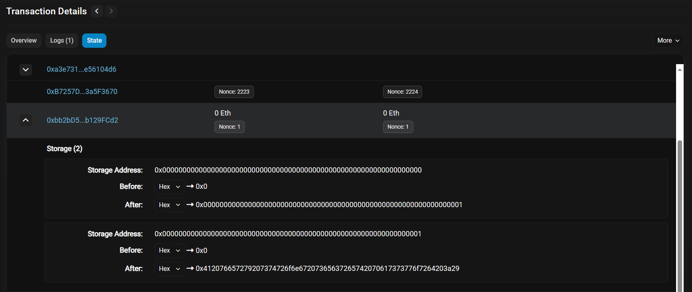

# 原始代码

# 攻击思路 1 ：反编译并直接读取 `storage`

合约的 bytecode 为：

```
0x6080604052348015600f57600080fd5b506004361060325760003560e01c8063cf309012146037578063ec9b5b3a146057575b600080fd5b60005460439060ff1681565b604051901515815260200160405180910390f35b60666062366004607f565b6068565b005b806001541415607c576000805460ff191690555b50565b600060208284031215609057600080fd5b503591905056fea2646970667358221220fc7b38e6559928e1e1112f630b03a26ee6eb52d794080ecd75435ef82810dd9b64736f6c634300080c0033 
```

将合约代码反编译如下：

```solidity
contract Contract {
    function main() {
        memory[0x40:0x60] = 0x80;
        var var0 = msg.value;
    
        if (var0) { revert(memory[0x00:0x00]); }
    
        if (msg.data.length < 0x04) { revert(memory[0x00:0x00]); }
    
        var0 = msg.data[0x00:0x20] >> 0xe0;
    
        if (var0 == 0xcf309012) {
            // Dispatch table entry for locked()
            var var1 = 0x43;
            var var2 = storage[0x00] & 0xff;
            var temp0 = memory[0x40:0x60];
            memory[temp0:temp0 + 0x20] = !!var2;
            var temp1 = memory[0x40:0x60];
            return memory[temp1:temp1 + (temp0 + 0x20) - temp1];
        } else if (var0 == 0xec9b5b3a) {
            // Dispatch table entry for unlock(bytes32)
            var1 = 0x66;
            var2 = 0x62;
            var var3 = msg.data.length;
            var var4 = 0x04;
            var2 = func_007F(var3, var4);
            func_0062(var2);
            stop();
        } else { revert(memory[0x00:0x00]); }
    }
    
    function func_0062(var arg0) {
        if (storage[0x01] != arg0) { return; }
    
        storage[0x00] = storage[0x00] & ~0xff;
    }
    
    function func_007F(var arg0, var arg1) returns (var r0) {
        var var0 = 0x00;
    
        if (arg0 - arg1 i>= 0x20) { return msg.data[arg1:arg1 + 0x20]; }
        else { revert(memory[0x00:0x00]); }
    }
}
```

观察到 `func_0062(var arg0)` 就是源代码中的 `unlock(bytes32 _password)` 函数。

而 `if (storage[0x01] != arg0) { return; }` 也暗示了密码就存在 `storage` 的第 1 个 slot 中。

故攻击代码为：

```javascript
await web3.eth.getStorageAt("0xBb8a99ea2083b53dd902956DbdEaE8db6f428684", 1)
```

获得密码后调用 `unlock` 即可。

# 攻击思路 2 ：解码创建合约实例时的交易信息

创建 instance 的交易 Hash 为： `0x0c4ce2b379b733a2067f1a5df45e18e1e26fed6b586b91e57932896229f5e29f`

新的 instance 合约地址为： `0xbb2bD57fc3f5500743BbaBC4f26644A4b129FCd2`

进入 Etherscan 查看该笔交易，进入 State ，可以发现 `0xbb2bD57fc3f5500743BbaBC4f26644A4b129FCd2` 的 storage 只发生了两个改变

* Storage Address : `0x0000000000000000000000000000000000000000000000000000000000000000`
  * before : `0x0`
  * after : `0x0000000000000000000000000000000000000000000000000000000000000001`
* Storage Address : `0x0000000000000000000000000000000000000000000000000000000000000001`
  * before : `0x0`
  * after : `0x412076657279207374726f6e67207365637265742070617373776f7264203a29`

很显然，密码就是 `0x412076657279207374726f6e67207365637265742070617373776f7264203a29` 。

