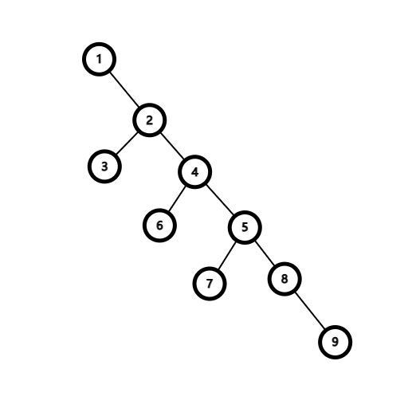

# 题目来源
[LOJ6669 Nauuo and Binary Tree](https://loj.ac/p/6669)

# 题意简述

这是一道**交互题**。

有一棵以 $1$ 为根的二叉树，你可以询问任意两点之间的距离，求出每个点的父亲。

节点数不超过 $3000$ ，你最多可以进行 $30000$ 次询问。

# 解题思路

观察数据范围可知，本题可以接受 $O(n^2)$ 的时间复杂度，但关键在于如何降低询问复杂度。

显然，本题需要由浅到深地逐层加入节点，否则就无从下手。

设当前待插入的节点为 $x$ 。

又由于本题的树满足二叉树的特殊性质，所以可以考虑 $x$ 是去左子树还是右子树。

如果暴力询问 $x$ 到左儿子和右儿子的距离，选择走哪一棵子树，最坏询问复杂度为 $O(n^2)$ ，具体情况如下图。

因此必须优化选择的方法。

由上图可知，造成单个点询问的复杂度达到 $O(n)$ 的原因是树的重心非常偏移。如果该树是完全二叉树，那么单个点询问的复杂度能稳定在 $O(\log n)$ 级别。

考虑对树进行重链剖分，每次只需要询问 $x$ **到当前重链底端的距离**。

