# 前言

本文是武汉大学经济与管理学院胡艺老师 2023 年秋的专业选修课《中级宏微观经济学》微观部分的同步课程笔记。

关于授课的资料，胡艺老师保留一切权利。

关于本课程的参考书翻译，东南大学曹乾老师明确声明禁止商用。

感谢胡艺老师、曹乾老师、范里安先生和其他对本课程做出贡献的人！

本文受到 MIT 许可协议的保护。请在使用本文档之前仔细阅读并遵守 MIT 许可协议的规定。

# 课程前言

不考勤，~~也就是说可以旷课~~，期末考试强度适中。

微观部分使用的资料是范里安《中级微观经济学：现代方法》，但不使用通行的出版译本《中级微观经济学：现代方法》，而使用东南大学曹乾翻译的《中级微观经济学：现代方法》完美中文翻译版。

# 第一章 市场

## 外生变量和内生变量

* 外生变量：不由该模型所讨论的因素决定的变量，简单理解为常量或参数。
* 内生变量：该模型所讨论的主要变量，简单理解为自变量。

## 最优化和均衡

经济学中最重要的两个问题：

* 最优化问题：将某个量最大化或最小化需要满足什么样的条件。
  * 微观中：效用最大化、利润最大化、成本最小化。
  * 宏观中：资本的黄金律水平。
* 均衡问题：广义均衡指的是经济主体的行为必须相互一致。
  * 均衡状态指的是这样一种状态，如果偏离了这种状态，总会存在一种内生的力量使得整个系统向着这种状态收敛。
  * 均衡在大多数时候是达不到的，但是向着均衡收敛的趋势是一直存在的，把握这种趋势比死守着均衡状态更有意义。

## 动态分析和静态分析

* 静态分析：只涉及两个“静态”均衡的比较，而不需要关心市场是怎样从一种均衡到达另一种均衡的。
* 动态分析：考虑时间因素，详细分析两种均衡态的具体转变过程。例如蛛网理论。

中初级经济学主要涉及的是静态分析尤其是静态比较分析。

## 帕累托效率

帕累托改进：如果可以找到一种配置方式，在其他人的情况没有变坏的情况下，的确能使得一些人的情况变得更好，这种配置方式就是帕累托改进。

* 帕累托低效：存在帕累托改进的情况。
* 帕累托有效：不存在帕累托改进的情况。

帕累托效率本身和公平无关，也就是说帕累托有效的状态不一定公平，而公平的状态可能也不有效。

举例分析：

* 完全竞争市场：帕累托有效，且公平。
* 完全歧视性的垄断市场：帕累托有效，但不公平。
* 一般垄断市场：帕累托低效，且不公平。
* 价格管制：帕累托低效，但公平。

帕累托效率是评价资源配置方式是否有效的一种标准。

## 长期均衡

长期中，供给和需求都可以进行调整，其结果会更加复杂，将在后面的章节讨论。

# 第二章 预算约束

## 预算约束

经济学关于消费者的理论：消费者总是选择他们**能够负担**的**最佳**物品。

* 能够负担：预算约束问题
* 最佳：效用最大问题

消费者能够承担的消费产品的集合叫做预算集。

一个消费束包含 $x_1$ 单位商品1， $x_2$ 单位商品2，……， $x_n$ 代表商品n，可以使用向量 $(x_1,x_2,\cdots,x_n)$ 表示。在本模型中，消费量是内生变量。

设商品价格分别为 $p_1,p_2,\cdots,p_n$ 。在本节中，价格不是我们关注的，因此认为是外生给定的变量。

当 $p_1x_1+p_2x_2+\cdots+p_nx_n\le m$ 的时候，消费者可以买得起消费束 $(x_1,x_2,\cdots,x_n)$ 。

其中 $m$ 为预算约束，也可以简单理解为消费者收入，不是我们关注的对象，因此是一个外生变量。

考虑到可行的消费束可能有很多个，因此使用集合表示

$$
\{(x_1,x_2,\cdots,x_n) | x_1\ge0,\cdots,x_n\ge0,\text{并且}p_1x_1+p_2x_2+\cdots+p_nx_n\le m\}
$$

## 预设两商品预算约束

问：为什么只分析两个商品就可以代表消费者决策？

答：假设我们关注的是商品1，那么我们就可以将其余的所有商品抽象为商品2。这样的假设足以代表所有的经济决策。

将预算约束方程

$$
p_1x_1+p_2x_2=m
$$

变形为

$$
x_2=-\frac{p_1}{p_2}x_1+\frac{m}{p_2}
$$

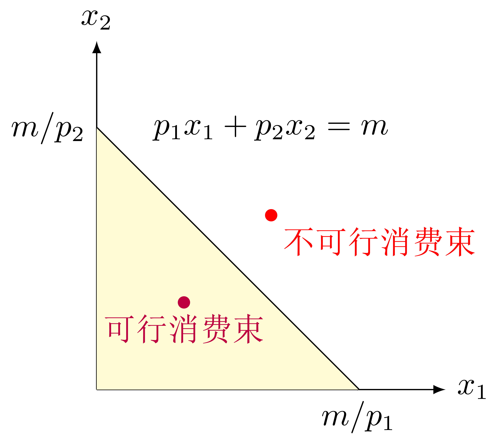

黄色区域是可行的消费束，也就是预算集。

其斜率是 $\displaystyle \frac{\mathrm{d} {x_2}}{\mathrm{d} {x_1}} = -\frac{p_1}{p_2}$ ，其含义为：增加一单位商品1的消费，则必须减少 $\displaystyle -\frac{p_1}{p_2}$ 单位商品2的消费。

## 预算线的变动

### 收入变化

平移

|                    预算增加                     |                    预算减少                     |
| :---------------------------------------------: | :---------------------------------------------: |
| 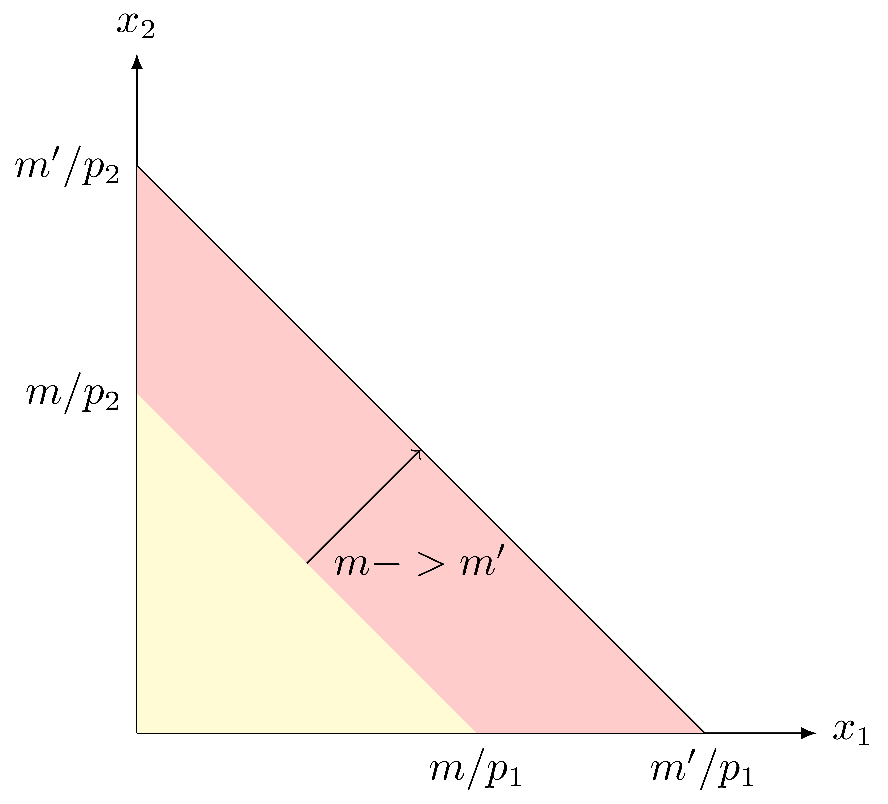 | 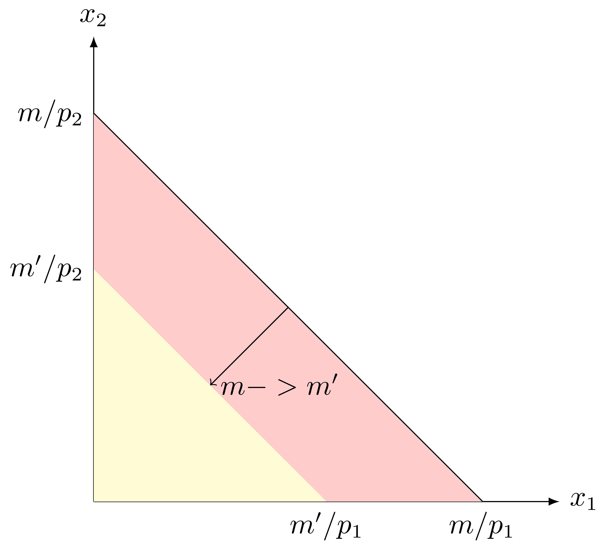 |

收入增加会导致消费者的状况变好，扩大预算集，改善消费者的选择。体现在图像上，表现为预算约束线的平行移动，斜率不变。

### 价格变化

假定 $p_1$ 从 $p_1'$ 下降到 $p_1''$ 。

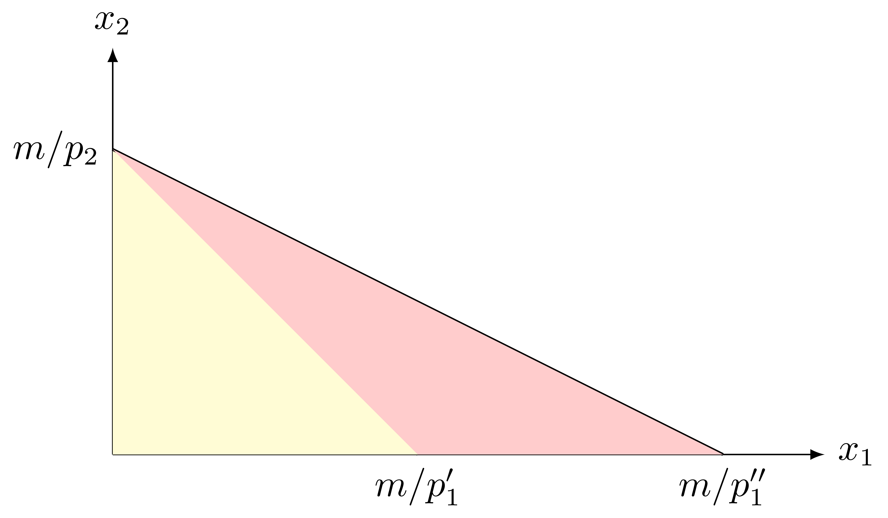

纵轴截距不变，约束线绕截距旋转。

### 税收

设按照 $t$ 税率收取从价税，预算约束方程为

$$
(1+t)p_1x_1+(1+t)p_2x_2=m
$$

也即

$$
p_1x_1+p_2x_2=\frac{m}{1+t}
$$

对价格征税其实减少了可支配收入，某种程度上相当于对收入征税。其图像与收入减少同理。

### 食品券计划

美国政府会向家庭发放食品券，在购买食品的时候可以冲抵现金。

假设收入为 $m=100$ ，食品价格为 $p_F=1$ ，其他商品价格为 $p_G=1$ 。

$$
F+G=m
$$

情况1：若家庭收到 $t=40$ 个单位的食品券时，预算集会扩大。

具体地，当食品消费量 $F\le40$ 的时候，食品券完全可以抵消食品消费，所有现金都用来购买其他商品；当食品消费量 $F>40$ 的时候，一部分现金需要用来购买食品。

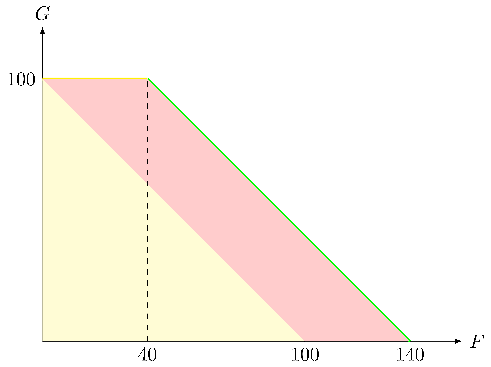

情况2：如果食品券可以在黑市上以每个 $0.5$ 美元的价格交易。

当食品消费量 $F\le40$ 的时候，多余的食品券可以卖成现金，用来购买其他商品。

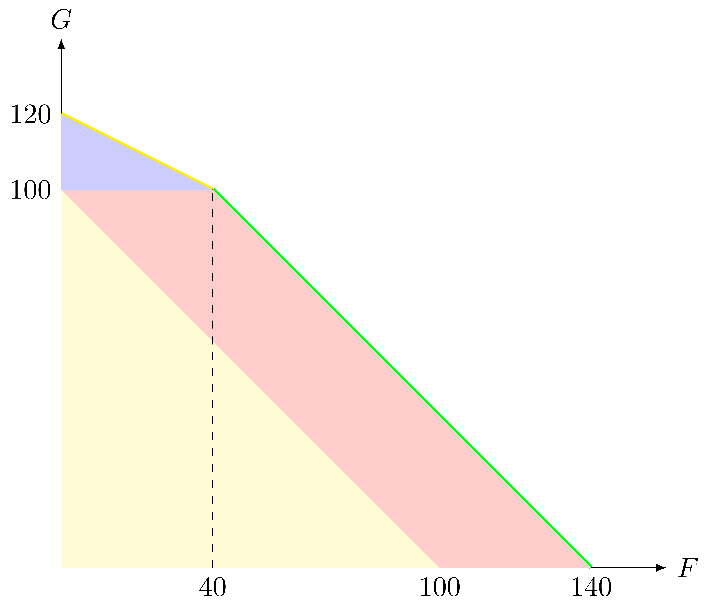

黑市为消费者提供了更多的消费选择，上图中的蓝色部分即为黑市带来的更大的消费束。

食品券和现金的汇率越接近 $1$ ，消费者的预算集就越大。

理论上说，直接发放现金带来的福利最大。

实际操作中，为什么发券不发钱？

* 用专门的消费券对消费进行结构性调整
* 中国地方政府发现消费券限定消费地点，意在拉动地方经济
* 减少冒领
* 发券工作本身就可以提供就业岗位

### 改变计价物

改变计价单位既不能改变预算约束也不能改变预算集。

## 更奇怪的预算约束线

### 数量折扣

假设 $p_2=1$ ， $p_1$ 满足

$$
p_1 = 
\begin{cases}
    2, & 0\le x_1\le20 \\
    1,  & x_1\ge20
\end{cases}
$$

那么约束线斜率满足

$$
-\frac{p_1}{p_2} = 
\begin{cases}
    -2, & 0\le x_1\le20 \\
    -1,  & x_1\ge20
\end{cases}
$$

数量折扣的预算约束线是上凸的。

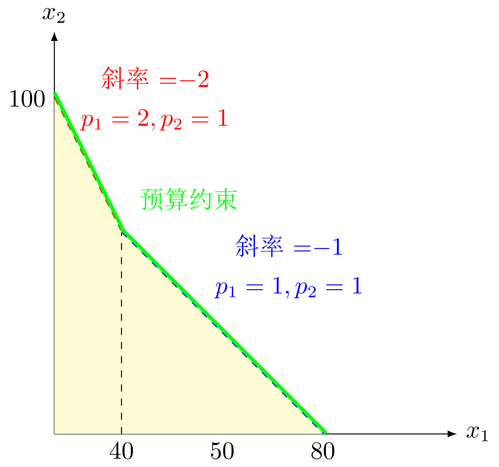

### 数量惩罚

诸如电费、税费、天然气等资源费用，使用量越多，价格越贵。

数量惩罚的预算约束线是下凹的。

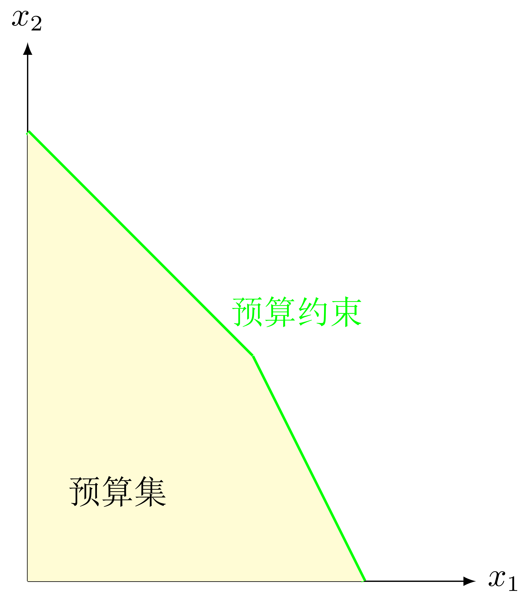

### 价格为负

商品1是一种恶臭的垃圾，你愿意以每单位 $2$ 美元的价格接受它。

具体地， $p_1=-2,p_2=1$ ，收入 $m=10$ ，则有

$$
-2x_1+x_2=10
$$

也就是

$$
x_2=2x_1+10
$$

其预算约束线和预算集非常不一样。

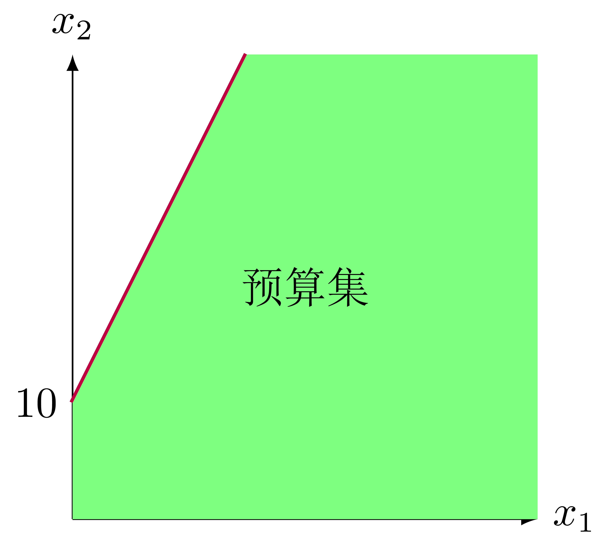

### 其他一般约束

消费者的选择是所有约束集的交点。

例如，下图中，黄色表示消费者至少消费一定量的食品才能生存，绿色表示预算约束，紫色表示消费者选择受到时间制约。那么真正的选择集是所有集合的交集。

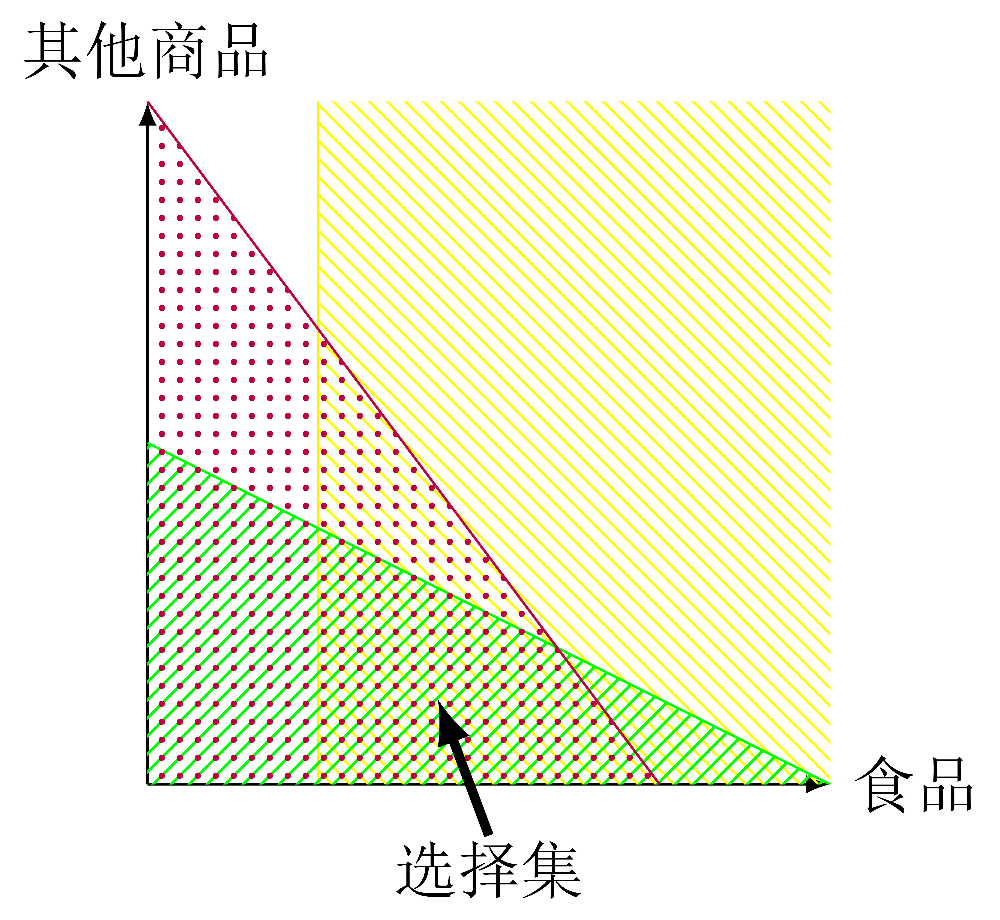

# 第三章 偏好

## 消费者偏好

假定：决策者总是从可选集中选择他最喜欢的决策方案。

对于两个不同的消费束 $x$ 和 $y$ ，定义

* 严格偏好：消费者更偏好 $x$ 一定胜过 $y$ ，记作 $x \succ y$ ；
* 弱偏好：消费者认为 $x$ 肯定不会比 $y$ 差，记作 $x \succeq y$ ；
* 无差异：消费者对于 $x$ 和 $y$ 有相同的偏好，记作 $x \sim y$ 。

## 关于偏好的假设

* 完备性：假定任意两个假定任意两个消费束是可以比较的。

    形式化地，对于两个不同的消费束 $x$ 和 $y$ ，一定有 $x \succeq y$ 或 $y \succeq x$ 。

* 反身性：任何一个消费束至少和它本身一样好。

    形式化地， $x \succeq x$ 。

* 传递性：如果 $x$ 弱偏好于 $y$ ， $y$ 弱偏好于 $z$ ，那么 $x$ 弱偏好于 $z$ 。

    形式化地， $x \succeq y \And y \succeq z \Rightarrow x \succeq z$ 

## 无差异曲线

给定消费束 $x'$ ，所有相对于消费束 $x'$ 有相同的偏好的消费束集称为包含 $x'$ 的无差异曲线; 所有与 $x'$ 有相同偏好的消费集可用 $y \sim x'$ 来表示。

由于无差异曲线并不总是一条曲线，所以一个更合适的名称可能为无差异消费集。

一般使用 $WP(x)$ 表示所有弱偏好于x的消费束， $SP(x)$ 表示严格偏好于x的消费束的集合且不包含 $I(x)$ 。

无差异曲线不能相交。

* 嗜好品：如果一个商品消费越多消费者越偏好，那么就是嗜好品。
* 厌恶品：如果一个商品消费越多消费者越不偏好，那么就是厌恶品。

如果每一件消费品都是嗜好品，那么无差异曲线斜率是负的。

厌恶品的无差异曲线斜率为正。其含义是，如果消费者不得不消费一定数量的厌恶品，那么一定需要多消耗一定数量的嗜好品作为补偿。

## 实例

### 完全替代品

其无差异曲线是一条直线，斜率不一定为 $-1$ 。

例如，一张面值20元的纸币和两张面值10元的纸币是完全替代品。

### 完全互补品

其无差异曲线是一条直角折线，拐点不一定在 $45\degree$ 线上。

例如，喝一杯咖啡必须搭配两勺糖，他们是完全互补品。

### 餍足

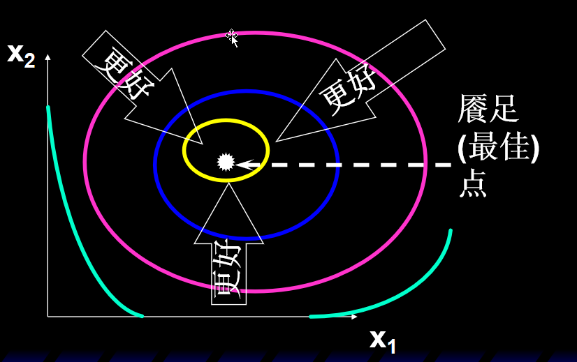

### 离散商品

无穷可分商品：如果我们能够得到一种商品的任何数量，那么就是无穷可分商品。例如水。

离散商品：如果一种商品的数量是离散、成块出现的，那么就是离散商品。

离散商品的无差异曲线是离散的点。

## 良好性状偏好

单调性（monotonicity）假设：给定两个商品束， $(x_1,x_2),(y_1,y_2)$ ，如果 $y_1>x_1,y_2>x_2$ ，则必有 $(y_1,y_2) \succ (x_1,x_2)$ 。

如果单调性假设成立，则满足：

1. 无差异曲线斜率为负
2. 平均束好于端点束

第二个假设表明，弱偏好于消费束 $(x_1,x_2)$ 的那个消费束集是**凸集**（convex set）。

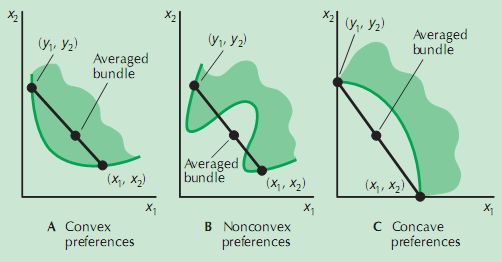

* 弱凸性：存在直线段
* 严格凸：完全是下凸的曲线

## 边际替代率

无差异曲线在某点的斜率就是**边际替代率**（Marginal Rate of Substitution, MRS），它表明消费者恰好愿意按照该比率，用少量商品 2 替代商品 1 。

若一单位商品 1 可以交换 $E$ 单位商品 2 ，其中 $E$ 称为交换率。如果 $MRS \ne E$ ，消费者就会用一种商品交换另一种商品；如果 $MRS \ne E$ ，消费者就不会交易，或者说这种交易发生或不发生其实无所谓。

边际替代率也可以被视为**边际支付意愿**（marginal willingness to pay）。

对于严格凸的无差异曲线，**边际替代率递减**（diminishing marginal rate of substitution）。

# 第四章 效用

在当代的消费者行为理论中，效用是衡量消费者偏好（consumer preferences）的一种方法而已，而不是衡量幸福的指标。

**效用函数**（utility function）是对每个消费束都赋予数值的一种方法，它必须满足单调性，即对于 $(y_1,y_2) \succ (x_1,x_2)$ ，必有 $u(x_1,x_2) > u(y_1,y_2)$ 。

效用函数的**单调变换**（monotonic transformation）是一个新的效用函数，它代表的偏好与原效用函数相同。

## 效用函数与无差异曲线

关于给定偏好关系的所有无差异曲线的集合构成了无差异曲线图。

一个无差异曲线图代表着一个效用函数，它们之间是相互对应的关系。

一个给定的偏好关系的效用函数不止一个。

一些特殊的效用函数

* 完全替代品： $V(x_1,x_2) = x_1 + x_2$ 
* 完全互补品： $W(x_1,x_2) = \min \{x_1, x_2\}$ 
* **拟线性偏好**： $U(x_1,x_2) = f(x_1) + x_2$ 
  * 所有的无差异曲线都可由一条无差异曲线垂直移动得到
  * 拟线性偏好（quasilinear utility）对于商品 2 是线性的，对于商品 1 （可能）是非线性的
  * 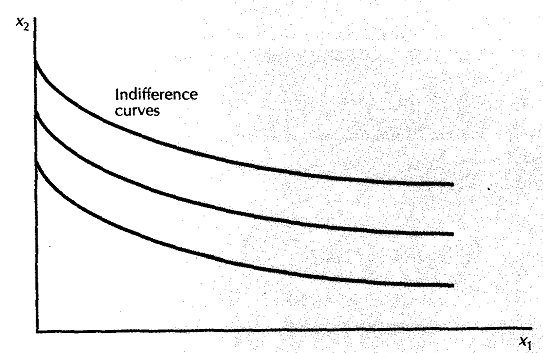
* 柯布-道格拉斯偏好： $u(x_1,x_2) = x_1^c x_2^d$ 
  * 所有曲线都是下凸双曲线
  * 大概是能产生良好性状偏好的最简单的代数表达式
  * 可以通过取对数变为线性函数
  * 可以通过指数归一化为一次函数

## 边际效用和边际替代率

**边际效用**（marginal utility）衡量增加一单位某商品消费带来的效用，即

$$
MU_1 = \frac{\Delta U}{\Delta x_1} = \frac{u(x_1+\Delta x_1,x_2) - u(x_1,x_2)}{\Delta x_1} = \frac{\partial {u(x_1,x_2)}}{\partial {x_1}}
$$

那么效用变化即为

$$
\Delta U = MU_1 \Delta x_1
$$

为了使消费束改变后依然落在之前的无差异曲线上，效用变化之和应为 $0$ ，即

$$
MU_1 \Delta x_1 + MU_2\Delta x_2 = \Delta U = 0
$$

可得

$$
MRS = \frac{\Delta x_2}{\Delta x_1} = -\frac{MU_1}{MU_2} = -\frac{\frac{\partial {U}}{\partial {x_1}}}{\frac{\partial {U}}{\partial {x_2}}}
$$

一般来讲，负号要不要不重要，一般将绝对值当做 $MRS$ 即可。

对于拟线性效用函数 $U(x_1,x_2) = f(x_1)+x_2$ 

$$
\frac{\partial {U}}{\partial {x_1}} = f'(x_1), \frac{\partial {U}}{\partial {x_2}} = 1
$$

故有

$$
MRS = -f'(x_1)
$$

也就是说，对于给定的 $x_1$ ，边际替代率对于是一个常数，而与 $x_2$ 无关。

## 单调变化与边际替代率

假如 $V = f(U)$ 是严格单增的函数，则必有

$$
MRS = -\frac{\partial V / \partial x_1}{\partial V / \partial x_2} = -\frac{f'(U)\partial U / \partial x_1}{f'(U) \partial U / \partial x_2} = \frac{\partial U / \partial x_1}{\partial U / \partial x_2} 
$$

即单调变换不会改变 $MRS$ 。

# 第五章 选择

## 理性

假设：决策者总是在他的可选范围内选择他最偏好的策略。

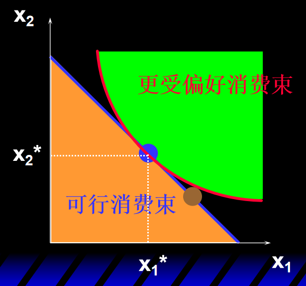

 $(x_1^*,x_2^*)$ 是最受偏好的可行消费束，称为最优选择（optimal choice）。此时的需求称为消费者的一般需求，可以用 $x_1^*(p_1,p_2,m),x_2^*(p_1,p_2,m)$ 来表示。

理想状态下，此时无差异曲线与预算约束线相切，

例外1：无差异曲线出现拐折（kink），在拐点没有切线。

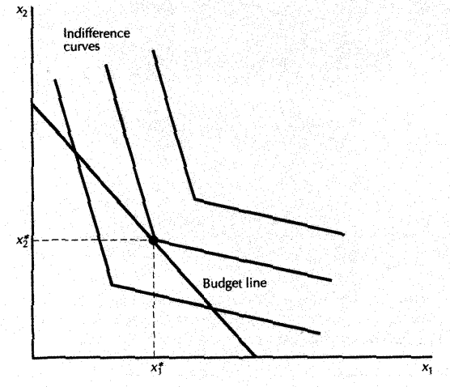

例外2：边界最优（boundary optimum），某种商品的消费量为 $0$ ，但无差异曲线与预算线依然不相切。

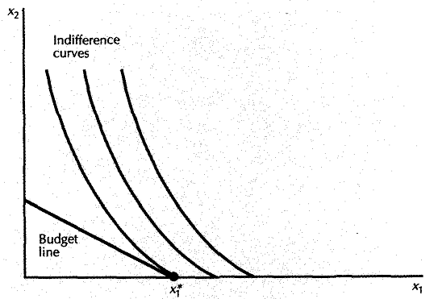

例外3：非凸性偏好

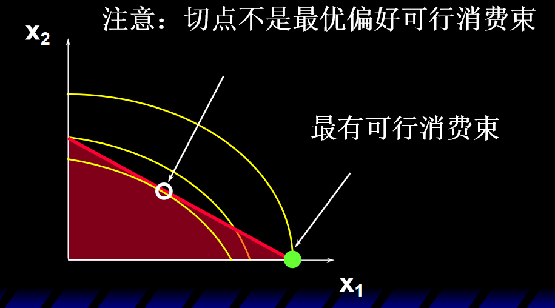

## 效用最大化

方法 1 ：利用价格之比等于边际替代率的结论进行计算

方法 2 ：拉格朗日乘数法

为了计算

$$
\max u(x_1,x_2)
\\
\text{ s.t. } p_1x_1+p_2x_2-m=0
$$

设拉格朗日函数

$$
L = u(x_1,x_2) - \lambda(p_1x_1+p_2x_2-m)
$$

那么最优选择 $(x_1^*,x_2^*)$ 必然同时满足

$$
\left\{
\begin{aligned}
    \frac{\partial {L}}{\partial {x_1}} = \frac{\partial {u(x_1^*,x_2^*)}}{\partial {x_1}} - \lambda p_1 = 0 \\
    \frac{\partial {L}}{\partial {x_2}} = \frac{\partial {u(x_1^*,x_2^*)}}{\partial {x_2}} - \lambda p_2 = 0 \\
    \frac{\partial {L}}{\partial {\lambda}} = p_1x_1+p_2x_2-m = 0
\end{aligned}
\right.
$$

解方程组即可得到效用最大化的需求量。

# 第六章 需求

一般需求函数的**比较静态分析**（comparative statics）：研究当价格 $p_1,p_2$ 和收入 $y$ 变化时，一般需求 $x_1^*(p1,p2,y)$ 和 $x_2^*(p1,p2,y)$ 如何变化。

|               正常品               |               劣等品               |
| :--------------------------------: | :--------------------------------: |
| 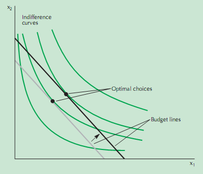 | 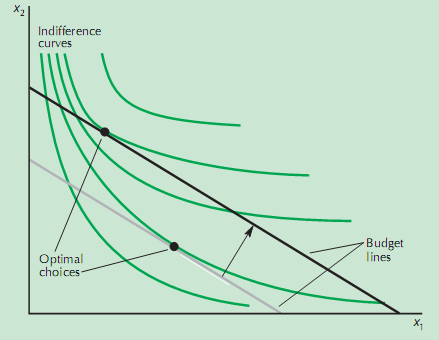 |
|        收入增加，需求量增加        |   收入增加，对 $x_1$ 的需求减少    |

## 收入提供曲线和恩格尔曲线

收入增加时，需求束平移形成了**收入提供曲线**（income offer curve），又称为收入扩展路径（income expansion path）。如果两种商品都是正常品，那么收入提供曲线的斜率为正。

然而，收入提供曲线只展现了消费束的变化，没有具体到某一个商品的需求量和收入的关系。**恩格尔曲线**（Engel curve）是在所有商品价格不变情形下，将某种商品的需求视作收入的函数而得到的曲线。

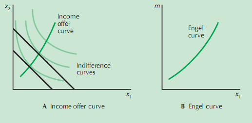

注意：纵轴 $m$ （收入）是自变量。

特殊的恩格尔曲线：

* 柯布道格拉斯效用：都是正比例直线
* 完全互补品：都是正比例直线
* 完全替代品：若 $p_1<p_2$ ，则价格低者为 $y=p_1x_1^*$ 正比例直线，价格高者为 $x_2^*=0$ 直线
* 拟线性效用：
    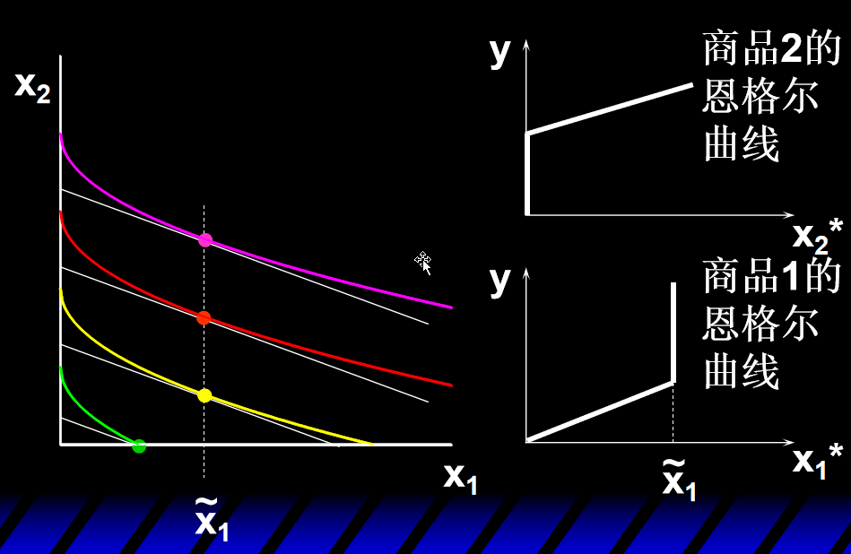
* 劣质品：
    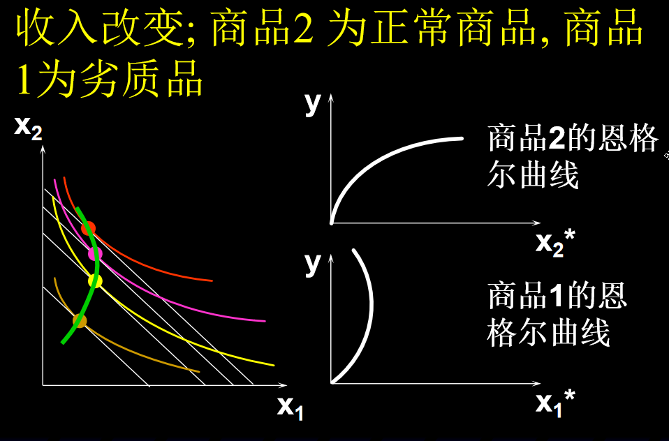

## 价格提供曲线和需求曲线

恩格尔曲线是预算约束线**整体平移**时消费束平移导出，而需求曲线是预算约束线**绕某一个截距旋转**时的消费束平移导出的。

|                普通商品                |                吉芬商品                |
| :------------------------------------: | :------------------------------------: |
| 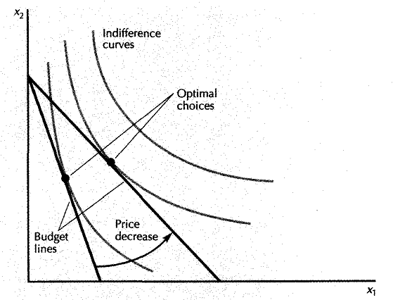 | 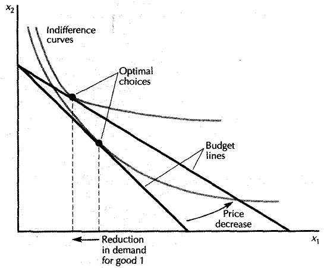 |
|          价格下降，需求量上升          |          价格上升，需求量上升          |

特殊的需求曲线：

* 柯布道格拉斯效用：矩形双曲线
* 完全互补品：
    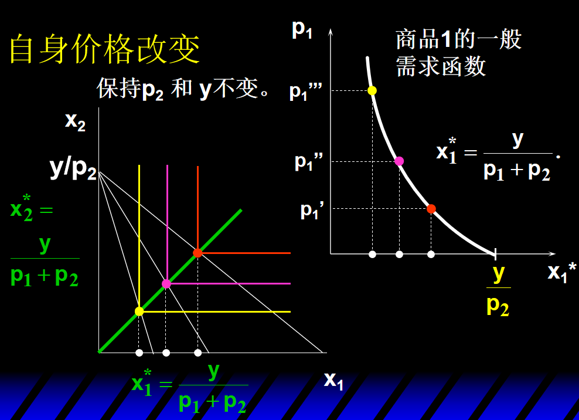
* 完全替代品：
    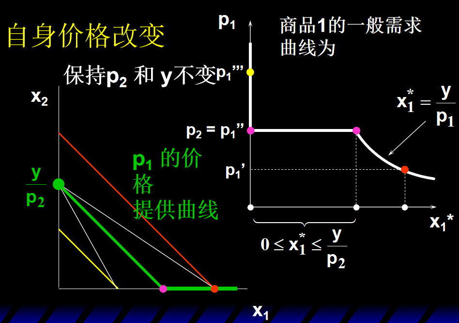

# 第七章 显示偏好

## 显示偏好

* 直接显示偏好（Direct Revealed Preference）：假设消费束 $y$ 也是可行的，但是消费者选择了消费束 $x^*$  ，那么消费束 $x^*$ 直接显示偏好于消费束 $y$ ，否则 $y$ 将被选择，表示为 $x \underset{D}{\succ} y$ 。
* 间接显示偏好（Indirect Revealed Preference）：如果 $x$ 直接显示偏好于 $y$ ， $y$ 直接显示偏好于 $z$ 。通过传递性， $x$ 间接显示偏好于 $z$ ，表示为 $x \underset{D}{\succ} y, y \underset{D}{\succ} z \Rightarrow x \underset{I}{\succ} z$ 
* 显示偏好弱公理（WARP）：如果消费束 $x$ 直接显示偏好于消费束 $y$ ，那么消费束 $y$ 不可能直接显示偏好于消费束 $x$ 。
* 显示偏好强公里（SARP）：如果消费束 $x$ 直接或者间接显示偏好于 $y$ 且 $x \ne y$ , 那么消费束y不可能直接或者间接显示偏好于 $x$ 。

## 指数

- 数量指数：价格加权的平均数量需求
  - 通用形式： $\displaystyle I_q = \frac{p_1x_1^t+p_2x_2^t}{p_1x_1^b+p_2x_2^b}$ ，其中 $(p_1,p_2)$ 可以是基期价格 $(p_1^b,p_2^b)$ ，也可以是当期价格 $(p_1^t,p_2^t)$ 。
  - 拉氏数量指数： $\displaystyle L_q = \frac{p_1^bx_1^t+p_2^bx_2^t}{p_1^bx_1^b+p_2^bx_2^b}$ ，若 $L_q<1$ ，表明消费者在基期比当期的处境好。
  - 派氏数量指数： $\displaystyle P_q = \frac{p_1^tx_1^t+p_2^tx_2^t}{p_1^tx_1^b+p_2^tx_2^b}$ ，若 $P_q>1$ ，表明消费者在当期的处境比基期好。
- 价格指数：数量加权的平均价格
  - 通用形式： $\displaystyle I_p = \frac{p_1^tx_1+p_2^tx_2}{p_1^bx_1+p_2^bx_2}$ ，其中 $(x_1,x_2)$ 可以是基期消费束 $(x_1^b,x_2^b)$ ，也可以是当期消费束 $(x_1^t,x_2^t)$ 。
  - 消费者开销比例： $\displaystyle M = \frac{p_1^tx_1^t+p_2^tx_2^t}{p_1^bx_1^b+p_2^bx_2^b}$ 
  - 拉氏价格指数： $\displaystyle L_p = \frac{p_1^tx_1^b+p_2^tx_2^b}{p_1^bx_1^b+p_2^bx_2^b}$ ，若 $L_p<M$ ，表明消费者在当期的处境比基期好。
  - 派氏价格指数： $\displaystyle P_p = \frac{p_1^tx_1^t+p_2^tx_2^t}{p_1^bx_1^t+p_2^bx_2^t}$ ，若 $P_p>M$ ，表明消费者在基期比当期的处境好

指数化对消费者选择的影响

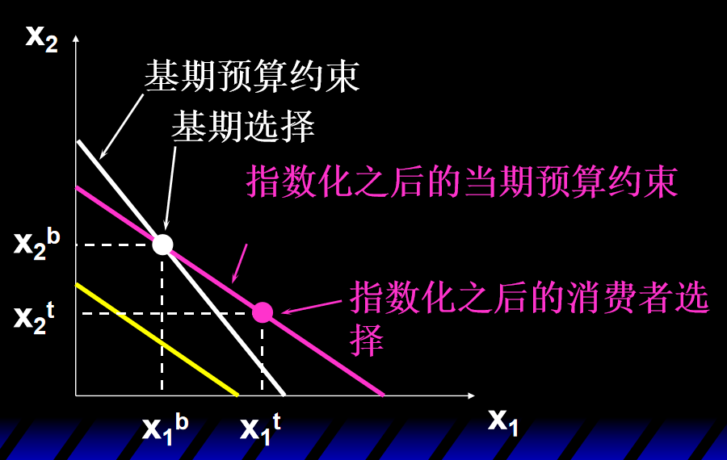

# 第八章 斯勒茨基方程

本章研究当一种商品的价格变化的时候，消费者的选择会怎样变化。

## 价格改变的效应

* 替代效应：一种商品价格下降，这种商品相对变得便宜, 因此消费者会增加它的消费而减少其它相对昂贵的商品的消费。
* 收入效应：消费者的预算可以购买更多的商品，也即消费者的收入比以前相对增加，那么消费者对商品的需求也会上升或下降。

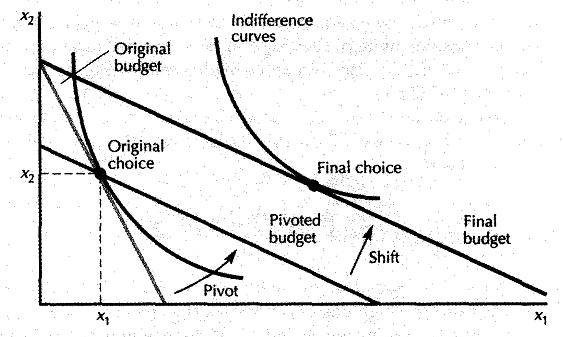

## 希克斯分解和斯勒茨基分解的辨析