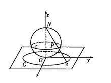

# 第一章 解析函数

## 第一节 复数及其运算

对于复数 $z=x+\mathrm{i}y\in\mathbb{C}$ ，称 $x=\mathrm{Re}z$ 为其实部， $y=\mathrm{Im}z$ 为其虚部。两复数相等，当且仅当他们的实部和虚部分别相等。用 $\overline{z}$ 或 $z^*$ 表示与 $z$ 实部相等、虚部相反的共轭复数（complex conjugation）。

通过两个共轭复数可以得出实部和虚部，这个方法非常重要。

$$x=\frac{z+\overline{z}}{2}$$ 

$$y=\frac{z-\overline{z}}{2\mathrm{i}}$$

复数与复平面上的点一一对应，与向量一一对应。

复数的表示方法：

1. 复向量 $\overrightarrow{OP}$ 
2. 三角函数表示法（极坐标） $\displaystyle z=\rho\cos\varphi+\mathrm{i}\rho\sin\varphi$ ，
3. 指数表示法 $\displaystyle z=\rho e^{\mathrm{i}\varphi}$ 
4. 黎曼球表示法

### 三角函数表示法

$\displaystyle \varphi=\mathrm{Arg}z$ 为辐角， $\rho$ 为模

辐角 $\varphi$ 满足 $\displaystyle\tan\varphi=\frac{y}{x}$ ，其主值 $\mathrm{arg}z\in(-\pi,\pi]$ 在第一、四象限与 $\displaystyle\arctan\frac{y}{x}$ 相等，在第二、第三象限与 $\displaystyle\arctan\frac{y}{x}$ 相差 $\pi,-\pi$ 。

理解： $\arctan$ 值域为 $\displaystyle\left(-\frac{\pi}{2},\frac{\pi}{2}\right)$ ，算出来的角都落在第一、第四象限。为了使得辐角主值和复数的坐标相匹配，对于原本在第二（第三）象限但却被 $\arctan$ 算到第四（第一）象限的那些角顺时针（逆时针）旋转 $180\degree$ ，使其回到第二（第三）象限。

### 黎曼球表示法（了解即可）

复球面与复平面切于复球面南极点 $S$ ，复球面的北极点 $N$ 与复球面上一点 $A'$ 延长线交复平面与点 $A$ 。

复球面上每一点与复平面上每一点一一对应，所以可以用 $A'$ 的坐标来代表 $A$ 的坐标。

当 $A'\rightarrow N$ 时，复平面上的 $A$ 趋于无穷远点。

