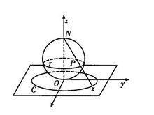

# 第一章 解析函数

## 第一节 复数及其运算

### 基本定义

对于复数 $z=x+\mathrm{i}y\in\mathbb{C}$ ，称 $x=\mathrm{Re}z$ 为其实部， $y=\mathrm{Im}z$ 为其虚部。两复数相等，当且仅当他们的实部和虚部分别相等。用 $\overline{z}$ 或 $z^*$ 表示与 $z$ 实部相等、虚部相反的**共轭复数**（complex conjugation）。

通过两个共轭复数可以得出实部和虚部，这个方法非常重要。

$$x=\frac{z+\overline{z}}{2}$$ 

$$y=\frac{z-\overline{z}}{2\mathrm{i}}$$

复数与复平面上的点一一对应，与向量一一对应。

复数的表示方法：

1. 复向量 $\overrightarrow{OP}$ 
2. 三角函数表示法（极坐标） $\displaystyle z=\rho\cos\varphi+\mathrm{i}\rho\sin\varphi$ ，
3. 指数表示法 $\displaystyle z=\rho e^{\mathrm{i}\varphi}$ 
4. 黎曼球表示法

### 三角函数表示法

$\displaystyle \varphi=\mathrm{Arg}z$ 为辐角， $\rho$ 为模

辐角 $\varphi$ 满足 $\displaystyle\tan\varphi=\frac{y}{x}$ ，其主值 $\mathrm{arg}z\in(-\pi,\pi]$ 在第一、四象限与 $\displaystyle\arctan\frac{y}{x}$ 相等，在第二、第三象限与 $\displaystyle\arctan\frac{y}{x}$ 相差 $\pi,-\pi$ 。

理解： $\arctan$ 值域为 $\displaystyle\left(-\frac{\pi}{2},\frac{\pi}{2}\right)$ ，算出来的角都落在第一、第四象限。为了使得辐角主值和复数的坐标相匹配，对于原本在第二（第三）象限但却被 $\arctan$ 算到第四（第一）象限的那些角顺时针（逆时针）旋转 $180\degree$ ，使其回到第二（第三）象限。

### 黎曼球表示法（了解即可）

复球面与复平面切于复球面南极点 $S$ ，复球面的北极点 $N$ 与复球面上一点 $A'$ 延长线交复平面于点 $A$ 。

复球面上每一点与复平面上每一点一一对应，所以可以用 $A'$ 的球坐标来代表 $A$ 的坐标。

当 $A'\rightarrow N$ 时，复平面上的 $A$ 趋于无穷远点。

### 复数的运算

复数的四则运算：略

复数运算的指数表达式：

* 乘法： $\displaystyle z_1\cdot z_2=\rho_1\rho_2\mathrm{e}^{\mathrm{i}(\varphi_1+\varphi_2)}$ 
* 除法： $\displaystyle \frac{z_1}{z_2}=\frac{\rho_1}{\rho_2}\mathrm{e}^{\mathrm{i}(\varphi_1-\varphi_2)}$
* 乘方： $\displaystyle z^n=\rho^n \mathrm{e}^{\mathrm{i}n\varphi}$ 
* 开方： $\displaystyle \sqrt[m]{z}=\sqrt[m]{\rho}\mathrm{e}^{\mathrm{i}\frac{\varphi}{m}}=\sqrt[m]{\rho}\mathrm{e}^{\mathrm{i}\frac{\mathrm{arg}z+2k\pi}{m}}, \ m=2,3,\cdots;k=0,\plusmn1,\plusmn2,\cdots$ 

复数开方有 $n$ 个 $n$ 次方根，其辐角也有 $n$ 个不同的取值， $k$ 把 $0,1,\cdots.n-1$ 取遍即可得到这 $n$ 个根，后面的都是重复的。这些根通常以共轭复根的形式配对出现，可以用这个规律来检查计算结果。

引申：如果三次方程至少有一个实根，如果有复数根，那么这两个复数根共轭。

棣莫弗公式：本质是欧拉公式当 $\rho=1$ 时的特例

$$(\cos\varphi+\mathrm{i}\sin\varphi)^n=\cos n\varphi+\mathrm{i}\sin n\varphi$$

### 复数的几何意义

复数与平面上的点一一对应。

应用：平面曲线 $f(x,y)=0$ 化为复表示方程 $F(z)=0$ 的方法

* 将  $\displaystyle\begin{cases}x=\frac{z+\overline{z}}{2} \\ y=\frac{z-\overline{z}}{2\mathrm i}\end{cases}$ 代入原方程 $f(x,y)=0$ ，即可得到以复数 $z$ 表示的方程。

两个复数相加，符合对角线规则。两个复数作差，符合三角形规则。

根据“平行四边形对角线平方和等于四条边平方和”，可得

$$|z_1+z_2|^2+|z_1-z_2|^2=2(|z_1|^2+|z_2|^2)$$

对于焦点在 $F_1,F_2$ 的椭圆上的一点 $P(x,y)$ ，易知 $\displaystyle|PF_1|=\left|x-(-\frac{c}{2})+(y-0)\mathrm i\right|=\left|z-\frac{c}{2}\right|$ ，同理 $\displaystyle|PF_2|=\left|z-\frac{c}{2}\right|$ .

根据椭圆的定义，椭圆方程也可以表示为  

$$\displaystyle \left|z+\frac{c}{2}\right|+\left|z-\frac{c}{2}\right|=2a$$ 

同理，直线 $ax+by+c=0$ 的复表示方程为

$$(a-\mathrm{i}b)z+(a+\mathrm{i}b)\overline{z}+2c=0$$

圆 $(x-a)^2+(y-b)^2=r^2$ 的复表示方程为

$$|z-(a+\mathrm{i}b)|=r$$

