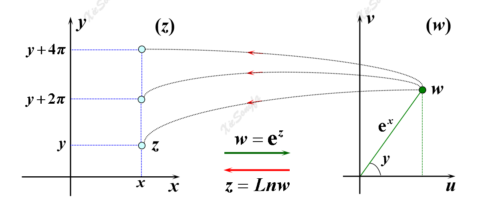

# 前言

本文由周国全老师的数学物理方法、翔翔的学习频道在B站上传的视频总结而来，借用了华中科技大学的复变函数讲义。

感谢周国全老师、UP主翔翔和华中科技大学！

# 第一章 解析函数

## 第一节 复数及其运算

### 基本定义

对于复数 $z=x+\mathrm{i}y\in\mathbb{C}$ ，称 $x=\mathrm{Re}z$ 为其实部， $y=\mathrm{Im}z$ 为其虚部。两复数相等，当且仅当他们的实部和虚部分别相等。用 $\overline{z}$ 或 $z^*$ 表示与 $z$ 实部相等、虚部相反的**共轭复数**（complex conjugation）。

通过两个共轭复数可以得出实部和虚部，这个方法非常重要。

$$x=\frac{z+\overline{z}}{2}$$

$$y=\frac{z-\overline{z}}{2\mathrm{i}}$$

复数与复平面上的点一一对应，与向量一一对应。

复数的表示方法：

1. 复向量 $\overrightarrow{OP}$
2. 三角函数表示法（极坐标） $\displaystyle z=\rho\cos\varphi+\mathrm{i}\rho\sin\varphi$ ，
3. 指数表示法 $\displaystyle z=\rho e^{\mathrm{i}\varphi}$
4. 黎曼球表示法

### 三角函数表示法

$\displaystyle \varphi=\mathrm{Arg}z$ 为辐角， $\rho$ 为模

辐角 $\varphi$ 满足 $\displaystyle\tan\varphi=\frac{y}{x}$ ，其主值 $\mathrm{arg}z\in(-\pi,\pi]$ 在第一、四象限与 $\displaystyle\arctan\frac{y}{x}$ 相等，在第二、第三象限与 $\displaystyle\arctan\frac{y}{x}$ 相差 $\pi,-\pi$ 。

理解： $\arctan$ 值域为 $\displaystyle\left(-\frac{\pi}{2},\frac{\pi}{2}\right)$ ，算出来的角都落在第一、第四象限。为了使得辐角主值和复数的坐标相匹配，对于原本在第二（第三）象限但却被 $\arctan$ 算到第四（第一）象限的那些角顺时针（逆时针）旋转 $180\degree$ ，使其回到第二（第三）象限。

### 黎曼球表示法（了解即可）

复球面与复平面切于复球面南极点 $S$ ，复球面的北极点 $N$ 与复球面上一点 $A'$ 延长线交复平面于点 $A$ 。

复球面上每一点与复平面上每一点一一对应，所以可以用 $A'$ 的球坐标来代表 $A$ 的坐标。

当 $A'\rightarrow N$ 时，复平面上的 $A$ 趋于无穷远点。

### 复数的运算

复数的四则运算

三角形式：

* 乘法： $\displaystyle z_1z_2=r_1r_2[\cos(\theta_1+\theta_2)+\mathrm{i}\sin(\theta_1+\theta_2)]$
* 除法： $\displaystyle z_1z_2=\frac{r_1}{r_2}[\cos(\theta_1-\theta_2)+\mathrm{i}\sin(\theta_1-\theta_2)]$
* 乘方：参见棣莫弗公式

指数表达式：

* 乘法： $\displaystyle z_1\cdot z_2=\rho_1\rho_2\mathrm{e}^{\mathrm{i}(\varphi_1+\varphi_2)}$
* 除法： $\displaystyle \frac{z_1}{z_2}=\frac{\rho_1}{\rho_2}\mathrm{e}^{\mathrm{i}(\varphi_1-\varphi_2)}$
* 乘方： $\displaystyle z^n=\rho^n \mathrm{e}^{\mathrm{i}n\varphi}$
* 开方： $\displaystyle \sqrt[m]{z}=\sqrt[m]{\rho}\mathrm{e}^{\mathrm{i}\frac{\varphi}{m}}=\sqrt[m]{\rho}\mathrm{e}^{\mathrm{i}\frac{\mathrm{arg}z+2k\pi}{m}}, \ m=2,3,\cdots;k=0,\plusmn1,\plusmn2,\cdots$

复数开方有 $n$ 个 $n$ 次方根，其辐角也有 $n$ 个不同的取值， $k$ 把 $0,1,\cdots.n-1$ 取遍即可得到这 $n$ 个根，后面的都是重复的。这些根通常以共轭复根的形式配对出现，可以用这个规律来检查计算结果。

引申：如果三次方程至少有一个实根，如果有复数根，那么这两个复数根共轭。

棣莫弗公式：本质是欧拉公式当 $\rho=1$ 时的特例

$$(\cos\varphi+\mathrm{i}\sin\varphi)^n=\cos n\varphi+\mathrm{i}\sin n\varphi$$

### 复数的几何意义

复数与平面上的点一一对应。

应用：平面曲线 $f(x,y)=0$ 化为复表示方程 $F(z)=0$ 的方法

* 将  $\displaystyle\begin{cases}x=\frac{z+\overline{z}}{2} \\ y=\frac{z-\overline{z}}{2\mathrm i}\end{cases}$ 代入原方程 $f(x,y)=0$ ，即可得到以复数 $z$ 表示的方程。

两个复数相加，符合对角线规则。两个复数作差，符合三角形规则。

根据“平行四边形对角线平方和等于四条边平方和”，可得

$$|z_1+z_2|^2+|z_1-z_2|^2=2(|z_1|^2+|z_2|^2)$$

对于焦点在 $F_1,F_2$ 的椭圆上的一点 $P(x,y)$ ，易知 $\displaystyle|PF_1|=\left|x-(-\frac{c}{2})+(y-0)\mathrm i\right|=\left|z-\frac{c}{2}\right|$ ，同理 $\displaystyle|PF_2|=\left|z-\frac{c}{2}\right|$ .

根据椭圆的定义，椭圆方程也可以表示为  

$$\displaystyle \left|z+\frac{c}{2}\right|+\left|z-\frac{c}{2}\right|=2a$$

同理，直线 $ax+by+c=0$ 的复表示方程为

$$(a-\mathrm{i}b)z+(a+\mathrm{i}b)\overline{z}+2c=0$$

圆 $(x-a)^2+(y-b)^2=r^2$ 的复表示方程为

$$|z-(a+\mathrm{i}b)|=r$$

<!-- 以上内容是根据 B 站周国全录播记录，太过繁琐，故切换为翔翔的学习频道 -->

## 第二节 复变函数

### 定义

设 $E\subset \mathbb{C}$ ，对于 $\forall z \in E$ 都有一个或多个 $w$ 使得

$$
w=f(z),z \in E
$$

则称 $w=f(z)$ 是 $z$ 的复变函数。

注意这里的函数一个自变量可能对应多个因变量，例如 $w=\sqrt{z}$ 就是一个多值函数。

同时注意到，若 $z=x+\mathrm{i}y$ ，则有

$$
w=f(z)=u(x,y)+\mathrm{i}v(x,y)
$$

这本质是一个关于 $x,y$ 的二元函数，因此研究复变函数其实也就是研究二元函数。

### 区域

需要注意的只有以下几点：

1. 沿着区域的边界走，区域在左方，则走向为边界的正向；
2. 闭区域 $\overline{\sigma}=\sigma+l$ 包括了区域和边界。

### 复变函数的连续性与极限

类似于二元函数的连续性，详细证明要用到 $\varepsilon-\delta$ 语言，这里不做展开。

性质：

1. 若两个函数在某点连续，则其和差积商在该点依然连续；
2. 在某点连续的函数，其复合函数在该点仍然连续；
3. 若 $f(z)$ 在闭区域 $\overline{\sigma}$ 上连续，则
   1. $f(z)$ 在 $\overline{\sigma}$ 上有界
   2. $|f(z)|$ 在 $\overline{\sigma}$ 上有最大值和最小值
   3. $f(z)$ 在 $\overline{\sigma}$ 上一致连续
4. $f(z)$ 在 $z_0$ 连续 $\Leftrightarrow$  $u(x,y),v(x,y)$ 在 $z_0$ 点连续。

## 第三节 解析函数

### 复变函数导数的定义

$$
\lim_{\Delta z\to 0} {\frac{\Delta f}{\Delta z}} = \lim_{\Delta z\to 0} {\frac{f(z+\Delta z)-f(z)}{\Delta z}}
$$

其求导法则与实变函数的求导法则一模一样，不做展开。

### 解析与柯西-黎曼条件

若 $f(z)$ 在邻域 $U(z_0)$ 中处处可导，则称 $f(z)$ 在 $z_0$ 处解析。解析又称为全纯。

解析必然可导，可导不一定解析

 $f(z)=u(x,y)+\mathrm{i}v(x,y)$ 在区域 $D$ 上解析的充分必要条件是：

 $f(z)$ 在区域 $D$ 上有一阶连续偏导数，且满足柯西黎曼方程

$$
\frac{\partial {u}}{\partial {x}} = \frac{\partial {v}}{\partial {y}} \\
$$

$$
\frac{\partial {u}}{\partial {y}} = -\frac{\partial {v}}{\partial {x}}
$$

复变函数求导，可以用 C-R 方程转换形式。

### 调和函数

若二元实函数 $u(x,y)$ 有二阶连续偏导数，且满足拉普拉斯方程

$$
\frac{\partial^2 u}{\partial x^2} + \frac{\partial^2 u}{\partial y^2} = 0
$$

则称 $u(x,y)$ 为调和函数。

若 $f(z)$ 是解析函数，则其实部 $u(x,y)$ 和虚部 $v(u,v)$ 都是调和函数，且称这两个函数互为共轭调和函数。

### 初等解析函数

#### 指数函数

$$
\mathrm{e}^z=\mathrm{e}^{x+\mathrm{i}y}=\mathrm{e}^x(\cos y+\mathrm{i}\sin y)
$$

性质：

1. 是单值函数，因为定义中的 $\mathrm{e}^x, \cos y, \sin y$ 都是单值函数。
2.  $\mathrm{e}^z$ 除无穷远点外处处有定义。当 $y=0$ 时， $\mathrm{e}^z=\mathrm{e}^x$ ，此时满足 $\displaystyle\lim_{x\to -\infty} {\mathrm{e}^z}=0,\lim_{x\to +\infty} {\mathrm{e}^z}=+\infty$ .
3.  $\displaystyle|\mathrm{e}^z|=\mathrm{e}^x$ ，注意这个等式两边都是实数。
4.  $\displaystyle (\mathrm{e}^z)'=\mathrm{e}^z$ 
5. $\text{Arg } \mathrm{e}^z=y+2k \mathrm{\pi},  (k=0,\pm1,\pm2,\cdots)$
6. 周期为 $2 \mathrm{\pi} \mathrm{i}$ 。这个周期是对于 $z$ 的周期，而不是对于 $x$ 或 $y$ 的周期。

指数函数非常重要。其他的初等函数都通过指数函数来定义。

#### 对数函数

对数函数定义为指数函数的反函数。满足方程 $\mathrm{e}^w=z$ 的函数 $w=f(z)$ 就是对数函数，记作 $w=\text{Ln }z$ 。

推导过程如下：令 $z=r \mathrm{e}^{\mathrm{i}\theta},w=u+\mathrm{i}v$ ，代入定义式 $e^w=z$ 得到

$$
\mathrm{e}^u\cdot \mathrm{e}^{\mathrm{i}v} = r\cdot \mathrm{e}^{\mathrm{i}\theta}
$$

为了使得该等式成立，需要满足：

$$
\left\{
\begin{aligned}
    & u=\ln {r}=\ln {|z|} \\
    & v=\theta=\text{Arg }z
\end{aligned}
\right.
$$

综合上述式子，得到 $\text{Ln }z$ 的具体计算公式：

$$
w=\text{Ln } z=\ln |z|+\mathrm{i}(\theta+2k \mathrm{\pi}), (k=0,\pm1,\pm2,\cdots)
$$

性质：

1.  $\text{Ln } z$ 是多值函数。 $k=0$ 时的函数值是函数的主值，记为 $w=\ln {z}$ ，这就是一个单值函数。对于某一个确定的 $k$ ，称 $w=\ln {z}+2k \mathrm{\pi}\mathrm{i}$ 为 $\text{Ln }z$ 的一个分支。
2. 定义域为 $z\ne0$ 。这是因为 $\ln|z|,\text{arg }z$ 在原点都没有意义，也可以理解为 $\mathrm{e}^w\ne0$ 。
3.  $\text{Ln } z$ 的各个分支在除去原点和负实轴的复平面内连续且解析，且满足 $\displaystyle \frac{\mathrm{d} {\text{Ln }z}}{\mathrm{d} {z}}=\frac{\mathrm{d} {\ln {z}}}{\mathrm{d} {z}} = \frac{1}{z}$ 。

#### 幂函数

其定义为：

$$
w=z^\alpha=\mathrm{e}^{\alpha\text{Ln }z}
$$

性质：

1.  $(z^\alpha)'=\alpha z^{\alpha-1}$ 
2.  $z^0=1$ 
3.  $\displaystyle z^\frac{m}{n}=\sqrt[n]{z^m}$ 
4.  若 $\alpha$ 为无理数或复数， $z^\alpha$ 一般是多值函数，此时处原点与负实轴外处处解析。

#### 三角函数

根据欧拉公式 $\mathrm{e}^{\mathrm{i}\theta}=\cos\theta+\mathrm{i}\sin\theta$ ，有 $\mathrm{e}^{-\mathrm{i}\theta}=\cos\theta-\mathrm{i}\sin\theta$ 

故有

$$
\cos \theta=\frac{\mathrm{e}^{\mathrm{i}\theta}+\mathrm{e}^{-\mathrm{i}\theta}}{2} \\
\sin \theta=\frac{\mathrm{e}^{\mathrm{i}\theta}-\mathrm{e}^{-\mathrm{i}\theta}}{2 \mathrm{i}} 
$$

将其中的 $\theta$ 全部换成 $z$ ，得到正余弦函数的定义：

$$
\cos z=\frac{\mathrm{e}^{\mathrm{i}z}+\mathrm{e}^{-\mathrm{i}z}}{2} \\
\sin z=\frac{\mathrm{e}^{\mathrm{i}z}-\mathrm{e}^{-\mathrm{i}z}}{2 \mathrm{i}} 
$$

其他三角函数的定义仿照实变函数退出即可。

性质:

1. 是单值函数。
2. 周期性、可导性、奇偶性、零点与实变函数一样。
3. 所有三角公式依然适用。
4. 有界性不成立，因为 $|\cos z|\le1,|\sin z|\le1$ 显然不满足。

#### 反三角函数

运用三角函数的定义，求出使得 $\cos w=z$ 成立的 $w$ ，便可定义 $w=\text{Arccos }z$ 。

$$
z=\cos w= \frac{\mathrm{e}^{\mathrm{i}w}+\mathrm{e}^{-\mathrm{i}w}}{2} \\
\Rightarrow (\mathrm{e}^{\mathrm{i}w})^2-2z\mathrm{e}^{\mathrm{i}w}+1=0 \\
\Rightarrow \mathrm{e}^{\mathrm{i}w}=z+\sqrt{z^2-1} \\
\Rightarrow w=\text{Arccos }z=-\mathrm{i}\text{Ln }(z+\sqrt{1+z^2})
$$

同理可得

$$
\text{Arcsin }z =-\mathrm{i}\text{Ln }(\mathrm{i}z+\sqrt{1-z^2})\\
\text{Arctan }z = \frac{\mathrm{i}}{2} \text{Ln }\frac{\mathrm{i}+z}{\mathrm{i}-z}
$$

#### 双曲函数与反双曲函数

略

# 第二章 复积分

## 第一节 定义与性质

将复平面内的一条光滑有向曲线 $C$ 划分成无穷个小段 $\Delta z_k$ ，每一段的长度趋近于 $0$ ，令 $\displaystyle\lambda=\max_{1\le k\le n}|\Delta z_k|$ ，在每个小段 $\Delta z_k$ 上取一点 $\zeta_k$ 。

若 $\displaystyle \lim_{\lambda\to 0} {\sum_{k=1}^n f(\zeta_k)\Delta z_k}$ 存在，则称之为 $f(z)$ 沿曲线 $C$ 的积分，记为 $\displaystyle \int_C f(z)\mathrm{d}z$ 。

注意：

1. 和式中的 $\Delta z_k$ 是一个复数，而不是这个复数的模。
2. 曲线积分是有方向的， $\displaystyle \int_{C^-} f(z)\mathrm{d}z$ 代表沿曲线 $C$ 负方向的积分。
3. 特别地， $\displaystyle \oint_{\varGamma} f(z)\mathrm{d}z$ 表示沿着**闭合**曲线 $\displaystyle\varGamma$ 逆时针方向的积分。

性质：

1. 满足线性运算规律，即 $\displaystyle\int_C[\alpha f(z)+\beta g(z)]\mathrm{d}z=\alpha\int_C f(z)\mathrm{d}z+\beta\int_C g(z)\mathrm{d}z$ 。
2. 反向积分的结果为相反数，即 $\displaystyle \int_C f(z)\mathrm{d}z=-\int_{C^-} f(z)\mathrm{d}z$。
3. 两段连续曲线积分可加，即 $\displaystyle \int_C f(z)\mathrm{d}z=\int_{C_1} f(z)\mathrm{d}z+\int_{C_2} f(z)\mathrm{d}z$ ，其中 $C=C_1+C_2$ 。
4. 积分的有界性，即 $\displaystyle \left| \int_C f(z)\mathrm{d}z\right| \le  \int_C |f(z)||\mathrm{d}z| = \int_C |f(z)|\mathrm{d}s \le ML$ ，其中 $\displaystyle M=\max_{z\in C}|f(z)|$ ， $L$ 为曲线 $C$ 的弧长。
5.  $\displaystyle\int_C |f(z)|\mathrm{d}s$ 又被称为第一类曲线积分。

## 第二节 计算方法

### 化为第二类曲线积分

$$
\int_C {f(z)} \mathrm{d} {z}
\begin{aligned}
    & = \int{(u+\mathrm{i}v)} (\mathrm{d}x+\mathrm{i}\mathrm{d}y )
    & = \int_C (u\mathrm{d}x-v \mathrm{d} y) + \mathrm{i}\int_C (v \mathrm{d}x + u \mathrm{d}y)
\end{aligned}
$$

格林公式：设 $D$ 为单连通区域，边界 $C$ 分段光滑，函数 $P(x,y),Q(x,y)$ 在 $\overline{D}=D+C$ 上的偏导数连续，则

$$
\oint_{C} {P}\mathrm{d} {x} + Q \mathrm{d} y=\iint_{D} \left(\frac{\partial {Q}}{\partial {x}}+\frac{\partial {P}}{\partial {y}}\right) \mathrm{d} {x} \mathrm{d} {y}
$$

注意PQ换位置。

### 直接化为定积分

设曲线 $C:z=z(t)=x(t)+\mathrm{i}y(t)，t:a\to b$ ，则

$$
\int_C{f(z)} \mathrm{d} {z}=\int_{a}^{b}{f[z(t)]} z'(t)\mathrm{d} {t} 
$$ 

$$ 
z'(t)=x'(t)+\mathrm{i}y'(t)
$$

### 其他方法

* 利用原函数计算，即牛顿-莱布尼茨公式 $\displaystyle \int_C{f(z)} \mathrm{d} {z}=F(z)|_{z_0}^{z_1}$ 
* 利用柯西积分公式、高阶导数公式
* 利用留数计算

## 第三节 柯西积分定理

### 柯西基本定理

> 1. 设函数 $f(z)$ 在单连通域 $D$ 内解析， $\varGamma$ 为 $D$ 内的任意一条简单闭曲线，则有 $\displaystyle \oint_{\varGamma} {f(z)}\mathrm{d} {z}=0$ 。
> 
> 2. 设 $f(z)$ 在单连域 $D$ 内解析，在 $\overline{D}=D+C$ 上连续，则有 $\displaystyle\oint_{C} {f(z)}\mathrm{d} {z}=0$ 。

简单理解成：绕着实心域积一圈回到原点，等于没积。

### 闭路变形定理

> 设 $f(z)$ 在双连通域 $D$ 内解析，在边界 $C=C_1+C_2^-$ 上连续， $\varGamma$ 是 $D$ 内的任意一条闭曲线，则有
> 
> $$
 \oint_{C_1} {f(z)}\mathrm{d} {z} = \oint_{C_2} {f(z)}\mathrm{d} {z} = \oint_{\varGamma} {f(z)}\mathrm{d} {z}
 $$

简单理解成：

* 绕着挖出一个空心的域（或者说环状域）中的一条曲线积分，完全等价于绕着外边界积分，也完全等价于绕着内边界积分。
* 绕着外边界逆时针积分一下，再绕着内边界顺时针积分一下，两个结果加起来一定等于 $0$ 。
* 正向应用：要求一个闭曲线的积分，可以找一条完全包住它的曲线来代替，也可以找一条完全被它包住的曲线来代替，通常情况下找圆就可以。
* 反向应用：已知一个闭曲线的积分，那么任何包住它的和被它包住的奇形怪状的曲线的积分都和已知曲线的积分相等。

证明有点复杂，且对做题无益，故略。

### 复合闭路定理

如果一个实心域被挖出很多个空心，那么绕着外边界逆时针积分一下，得到积分 $I_0$ ；绕着每个内边界逆时针积分一下，求和得到 $I_1+I_2+\cdots+I_n$ ，则有

$$
I_0=I_1+I_2+\cdots+I_n
$$

证明略。

### 路径无关性

上面三个定理探讨的都是闭合曲线的积分，这个路径无关性却适用于非闭合曲线的积分。

内容：解析函数在单连域内的积分之和起点和终点有关，而和路径无关。

> 在单连通解析域 $D$ 中，假设 $C_1,C_2$ 是从 $z_0,z_1$ 的两条不同的曲线，则有
> 
> $$
\oint_{C_1} {f(z)}\mathrm{d} {z}=\oint_{C_2} {f(z)}\mathrm{d} {z}=\int_{z_0}^{z_1}{f(z)} \mathrm{d} {z}
$$

### 复积分的牛顿-莱布尼茨公式

若单连域内存在 $F'(z)=f(z)$ 恒成立，则称 $F(z)$ 是 $f(z)$ 的一个原函数，函数 $f(z)$ 为原函数 $F(z)+c$ 的不定积分，记作

$$
\int{f(z)} \mathrm{d} {z}=F(z)+c
$$

称形如 $\displaystyle F(z)=\int_{z_0}^{z}{f(\xi)} \mathrm{d} {\xi}$ 的函数为积分上限函数，利用积分上限函数和复积分的运算规律，可以得出复积分的牛顿-莱布尼茨公式。

> 若 $f(z)$ 在单连域 $D$ 内处处解析， $G(z)$ 为 $f(z)$ 的原函数，则有
> 
> $$
\int_{z_0}^{z_1}{f(z)} \mathrm{d} {z} = G(z_1) - G(z_0)
$$

## 第四节 柯西积分公式

### 柯西积分公式

> 对于单连域 $\overline{D}=D+C$ 中的一点 $z_0$ ，有
> 
> $$
f(z_0)=\frac{1}{2 \mathrm{\pi} \mathrm{i}}\oint_{C} {\frac{f(z)}{z-z_0}}\mathrm{d} {z}
$$

这意味着：解析函数在解析区域内某一点的函数值，可以用其解析区域边界上的值以一种特定的积分形式表达出来。

该定理可以扩展到多连域，把中间挖空的部分减掉就行了。

应用：

* 已知某条曲线的积分，求曲线内某一点的函数值。这个不太可能直接用到，因为题目不太可能直接把积分结果给你。但是有时如果想求某个很难求的函数值，可以考虑用其他方法求出积分，再等价为函数值。
* 已知某一点的函数值，求包绕着他的某条曲线的积分。具体来说，如果形如 $\displaystyle\frac{f(z)}{z-z_0}$ 的待积式在 $z_0$ 处恰好不解析，但是函数值 $f(z_0)$ 又存在，那么就可以把积分转化为函数值。

$$
\oint_{C} {\frac{f(z)}{z-z_0}}\mathrm{d} {z} = 2 \mathrm{\pi} \mathrm{i} f(z_0)
$$

### 平均值公式

> 如果函数 $f(z)$ 在 $|z-z_0|\le R$ 的圆域内解析，在圆内和圆周上连续，则有
> 
> $$
f(z_0)=\frac{1}{2 \mathrm{\pi}}\int_{0}^{2 \mathrm{\pi}}{f(z_0+R \mathrm{e}^{\mathrm{i}\theta})} \mathrm{d} {\theta}
$$

这就是柯西积分公式在圆域情况下的一个特例。

 $R \mathrm{e}^{\mathrm{i}\theta}$ 在 $\theta$ 从 $0$ 到 $2\pi$ 转一圈后其实就是一个圆，而  $z_0+R \mathrm{e}^{\mathrm{i}\theta}$ 就是把圆心挪到了 $z_0$ 处，因此该式显然成立。

可以理解为， $z_0$ 处的函数值就是以他为圆心的圆的圆周上的函数值的平均值，只不过这里的平均既不是几何平均也不是算数平均，而是极坐标下的积分平均。

### 最大模定理

> 如果函数 $f(z)$ 在 $D$ 内解析，且不为常数，则 $|f(z)|$ 在 $D$ 内没有最大值。

注意，这里的 $D$ 不是 $\overline{D}$ ，也就是说不包含边界。

没有最大值不是说他趋于无穷，而是说他有界，但是取不到上界。

推论：

1. 如果能在 $D$ 上取到最大值，那此函数必然恒为常数。
2. 在包含边界的 $\overline{D}$ 中一定可以取到最大值，且最大值就在边界上取到。

## 第五节 解析函数的高阶导数

### 高阶导数定理

$$
f^{(n)}(z)=\frac{n!}{2 \mathrm{\pi} \mathrm{i}}\oint_{C} {\frac{f(\zeta)}{(\zeta-z)^{n+1}}}\mathrm{d} {\zeta}
$$

意义：

1. 解析函数的导数仍解析。
2. 可以用来求导。
3. 可以用来计算积分（如果导数更好求的话）。

$$
\oint_{C} {\frac{f(z)}{(z-z_0)^{n+1}}}\mathrm{d} {z} = \frac{2 \mathrm{\pi} \mathrm{i}}{n!} f^{(n)}(z_0)
$$

# 第三章 复级数

## 第一节 复数项级数

### 复数序列

复数序列定义、极限、敛散性等基本概念，与实数数列类似。

复数序列极限存在的充要条件：

> 设 $\displaystyle z_n=x_n+\mathrm{i}y_n, a=\alpha+\mathrm{i}\beta$ ，
> 
> 则 $\displaystyle\lim_{n\to +\infty} {z_n}=a$ 的充要条件是 $\displaystyle \lim_{n\to +\infty} {x_n}=\alpha, \lim_{n\to +\infty} {y_n}=\beta$ 。

证明略。

用处：要求复数列的极限，需要把其通项公式的实部和虚部分离出来，分别求极限。

推论：

1.  $\{z_n\}$ 收敛  $\Rightarrow$  $\{|z_n|\}$ 收敛，反过来则推不出。
2.  $\displaystyle \lim_{n\to +\infty} {|z_n|}=0 \Leftrightarrow \lim_{n\to +\infty} {z_n}=0$ 

### 复数项级数

复级数的定义、部分和、敛散性与实数项级数的定义类似。

复级数收敛的充要条件：

> 设 $\displaystyle z_n=x_n+\mathrm{i}y_n$ ，
>
> 则级数 $dis\sum z_n$ 收敛的充要条件是级数 $\sum x_n$ 和 $\sum y_n$ 都收敛。

证明略。

复级数收敛的必要条件：

> 设 $\displaystyle z_n=x_n+\mathrm{i}y_n$ ，
>
> 则级数 $\sum z_n$ 收敛的必要条件是 $\displaystyle \lim_{n\to +\infty} {z_n} = 0$ 

证明略。其实是显然的。如果数列的极限都不趋于 $0$ ，那么加起来肯定越加越大或者越加越小。

绝对收敛与条件收敛与实数项级数类似。在 $|z_n|$ 收敛的条件下：

1. 若 $\sum |z_n|$ 收敛，则称 $\sum z_n$ 绝对收敛。
2. 若 $\sum |z_n|$ 发散， $\sum z_n$ 收敛，则称 $\sum z_n$ 条件收敛。

## 第二节 复变函数项级数

### 基本概念

其定义、部分和、敛散性、和函数、收敛域等相关概念与实变函数项级数非常相似。

### 幂级数

形如 $\displaystyle \sum_{n=0}^{+\infty} a_n(z-a)^n = a_0+a_1(z-a)+a_2(z-a)^2+\cdots$ 的级数称为幂级数。

特别地，当 $a=0$ 时有 $\displaystyle \sum_{n=0}^{+\infty} a_nz^n = a_0 + a_1z+a_2z^2+\cdots$ ，是幂级数的主要研究对象。

阿贝尔定理：

> 对于幂级数 $\displaystyle \sum_{n=0}^{+\infty} a_nz^n$ ，有
>
> 1. 如果级数在 $z_0$ 处收敛，则它在 $|z|<|z_0|$ 上绝对收敛；
>
> 2. 如果级数在 $z_1$ 处发散，则它在 $|z|>|z_1|$ 上发散。

证明略。

可见，幂级数的收敛域是复平面上的一个圆，称之为收敛圆，其半径为收敛半径。圆内收敛，圆外发散，圆周需要讨论。

约定 $R=0$ 表示级数仅在 $z=0$ 处收敛， $R=+\infty$ 表示级数在整个复平面上收敛。

一个比较重要的级数和： $\displaystyle 1+z+z^2+\cdots=\frac{1}{1-z},(|z|<1)$ 。

求收敛半径的方法依然是实变中的两个：比值法和根式法。

1. 比值法： $\displaystyle R=\lim_{n\to +\infty} {\frac{|a_n|}{|a_{n+1}|}}$ 
2. 根式法： $\displaystyle R=\lim_{n\to +\infty} {\sqrt[n]{|c_n|}}$ 

### 幂级数的性质

1. 运算性质：满足欧式空间中的线性运算规律，即

$$
\sum_{n=0}^{+\infty} a_nz^n + \sum_{n=0}^{+\infty} b_nz^n = \sum_{n=0}^{+\infty} (a_n+b_n)z^n
$$

$$
\sum_{n=0}^{+\infty} a_nz^n \cdot \sum_{n=0}^{+\infty} b_nz^n = \sum_{n=0}^{+\infty} \left(\sum_{k=0}^n a_kb_{n-k}\right)z^n
$$

2. 分析性质：
   1. 幂级数在收敛圆内解析
   2. 幂级数的导数，等于逐项求导再相加
   3. 幂级数的积分，等于逐项积分再相加
3. 代换性质：幂级数中的 $z$ 可以换成 $g(z)$ ，只要满足 $|g(z)|<R$ 并且在收敛圆内解析即可。

## 第三节 泰勒级数

### 内容

与实变函数的泰勒定理类似，复变函数也满足类似的性质，可以以某一个点为基准点得到一个泰勒展开式，从而用一个不包含超越函数的多项式表示任意一点的函数值。

> 设函数 $f(z)$ 在 $D$ 内解析，以 $D$ 内某点 $z_0$ 为圆心的最大圆中， $f(z)$ 满足
>
> $$f(z)=\sum_{n=0}^{+\infty} a_n(z-z_0)^n$$
> 
> 其中 $\displaystyle a_n=\frac{1}{n!}f^{(n)}(z_0) = \frac{1}{2 \mathrm{\pi} \mathrm{i}}\oint_{l} {\frac{f(z)}{(z-z_0)^{n+1}}}\mathrm{d} {z}$ ， $l$ 为 $D$ 内包围 $z_0$ 点的任意一套闭合曲线。

一个函数以任意一个点为圆心进行展开，其结果是完全等效的。

因此，如果方便，可以直接以原点为圆心进行展开，就类似于实变函数的麦克劳林展开。

### 常用的泰勒展开式

$$
\frac{1}{1-z} = \sum_{n=0}^{+\infty} z^n = 1+z+z^2+z^3+\cdots, |z|<1
$$

$$
e^z = \sum_{n=0}^{+\infty} \frac{z^n}{n!} = 1+z+\frac{z^2}{2!}+\frac{z^3}{3!}+\cdots,|z|<+\infty
$$

一般来讲，如果直接求导存在困难，应当考虑把待展开的函数化成已知的级数形式，然后把它当做复合函数，用代换性质作展开。