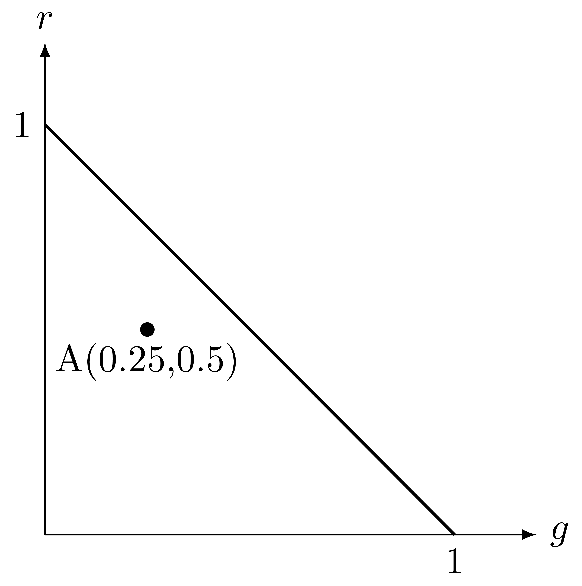

# 前言

本文是武汉大学国家网络安全学院马桃林老师 2023 年秋《色彩原理与应用》同步课程笔记。

本课程相关的课件、作业、笔记等，仅供参考学习使用，严禁商用。马桃林老师保留相关的一切权利。

# 导论

本课程开课十年多，得到许多学生的喜爱。

学了本课程，你可以：

* 理解知名产品的设计思维
* 能用准确的语言描述颜色
* 了解颜色的搭配的科学，~~提高衣品~~

## 课程安排

本课程2学分。

32学时，其中讲授26学时，实践6学时

## 考核

* 结课论文：50%
* 作业1：15%
* 论文2：15%
* 课堂考勤：20%

老师不喜欢捞人，想满绩的话每个环节都要重视。

## 参考资料

教材：

* 《色彩构成与应用》 林伟
* 《色彩构成与应用》 王涛鹏等 

## 教学内容

1. 第一章 颜色基本知识
   1. 什么是色彩
   2. 色彩研究的历史
   3. 颜色形成的要素
   4. 颜色的分类与颜色的基本特性
   5. 视觉功能
2. 第二章 颜色视觉
   1. 视网膜的颜色区
   2. 颜色辨别
   3. 颜色适应
   4. 颜色恒常性
   5. 颜色对比
   6. 色弱与色盲
   7. 边界对比
   8. 颜色错觉
   9. 颜色的距离感
   10. 颜色的味觉感
3. 第三章 颜色混合规律和视觉理论
   1. 色光加色法
   2. 色料减色法
   3. 加色法与减色法的关系
   4. 色光混合规律——格拉斯曼定律
   5. 颜色视觉理论
4. 第四章 孟塞尔及其他标色系统
   1. 显色标色系统概述
   2. 孟塞尔系统
   3. 中国颜色体系
   4. 奥斯瓦尔德系统
   5. 自然色系统（NCS）
   6. 系统实用色序系统
5. 第五章 颜色联想与表达
   1. 颜色的联想
   2. 色彩的感觉
   3. 颜色搭配
6. 颜色应用搭配规律分析
   1. 包装设计中的颜色应用规律分析
    * 实践 1 （学生自行前往商场调研，撰写论文）
   2. 服装颜色搭配规律分析
   3. 室内设计颜色的应用分析
    * 实践 2 （）

## 作业提交说明

命名：院系简称+学生姓名（学号后四位）+作业X+作业名

作业统一于 11 月 27 日（周一）前发到老师的私人邮箱 mtl1968@whu.edu.cn。

老师收到作业后会及时回复，如果提交作业后 3 个工作日没有收到回复，要及时查询。

11 月 30 日之前老师会整理所有作业，如有打不开、缺失、未交等信息，会在微信群里发布，需及时关注。

成绩在期末前两周上传，提交给院系学校审核，通过后才能看到成绩。

想满绩需要认真听讲并及时完成作业和论文。

作业格式篇幅不限，结业论文按照一般期刊论文格式要求，3-4页。

作业考察重点：

* 主题思想，也就是论文写了哪些内容
* 论文版式是否规范
* 论文层次是否清晰
* 论文内容是否丰富完整

理论是否正确、论证是否严谨是次要的。

重要内容应当加粗，方便老师阅读。

论文最后给自己评分，向老师暗示自己的得分期望，但论文质量要和自评分相符。

# 第一章 颜色基本知识

## 什么是颜色

在人的所有感官中，视觉提供的信息量最大（占80%），视神经对颜色的反应最快（快于对形状的感知）。

衣着的搭配、食物的上色、室内装潢、汽车设计、自然景观、文艺作品，都涉及到了颜色。

关于色彩的定义，不同的学科有不同的描述。

中国国家标准 GB5698-85 ：“颜色是光作用于人眼引起**除形象以外**的视觉特性。”

光源发出不同波长的光照射在物体表面，物体选择性地反射或投射其中的部分光谱成分进入人的眼睛，人眼将光刺激转化为神经冲动传到大脑的视觉中枢，由视觉中枢判定并产生颜色感觉。

颜色现象是客观存在的光刺激在人们头脑中的主观印象。

颜色感知过程包括了物理过程、生理过程和心理过程。

## 颜色理论的发展历史

古代人是被动看到颜色的，而现代人的许多颜色是主动创造并使用的。

* 亚里士多德：色彩学理论的开创者，认为白、黑、黄是各自独立的基本色彩，其他色彩介于这三种颜色之间，或由这三种颜色混合生成。树叶的色彩变化是含水量多少决定的，水分越多树叶越绿。
* 歇尼尔：1627年德国，认为外部光线作用于人眼形成物体的影像。
* 牛顿：1666年英国，用三棱镜分解白光，发现色散现象，说明自然光是由多种色光组合而成的，并出版《光学》一书，立足于物理学来研究色彩，是近代色彩学的起点。。
* 扬（1704，英）与亥姆霍兹（德）：三原色理论。
* 路易（1807，法）：减色混合法，成为彩色印刷的基本理论。
* 格拉斯曼（1854）：总结出格拉斯曼颜色混合定律，奠定了色度学的实验基础。
* 麦克斯韦（1865）：电磁场理论。
* E.Hering（1878）：四色学说
* 1915年《孟塞尔颜色图册》
* CIE色度学体系的建立

首先规定红光、绿光、蓝光的标准频率，令三原色的强度各自为

$$
r=\frac{R}{R+G+B}
$$

$$
g=\frac{G}{R+G+B}
$$

$$
b=\frac{B}{R+G+B}=1-r-g
$$

则可以用麦克斯韦颜色三角形中的点来表示任意颜色。

上图中的点表示的颜色即 $r=0.5,g=0.25,b=0.5$ 的颜色、

### CIE1931 RGB系统

### CIE1931 XYZ系统

### CIE1964 补充标准

### CIE1960UCS

### CIE1964 均匀色彩空间

### CIE1976Lab

### CIE1976L\*a\*b\*

### CIE1976L\*u\*v\*

## 形成颜色的要素

## 颜色的分类与颜色特性

## 视觉功能