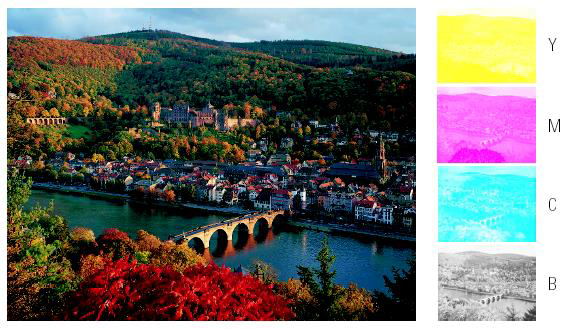
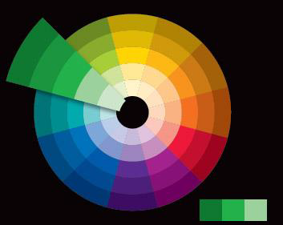
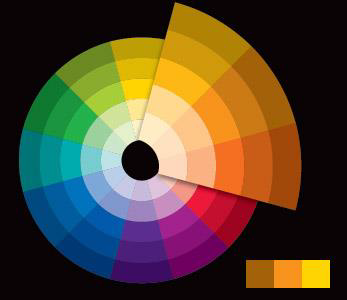
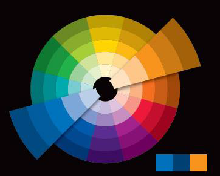
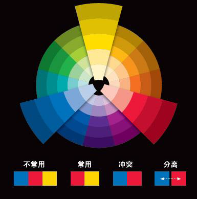

# 前言

本文是武汉大学国家网络安全学院马桃林老师 2023 年秋《色彩原理与应用》同步课程笔记。

本课程相关的课件、作业、笔记等，仅供参考学习使用，严禁商用。马桃林老师保留相关的一切权利。

# 导论

本课程开课十年多，得到许多学生的喜爱。

学了本课程，你可以：

* 理解知名产品的设计思维
* 能用准确的语言描述颜色
* 了解颜色的搭配的科学，~~提高衣品~~

## 课程安排

本课程2学分。

32学时，其中讲授26学时，实践6学时

## 考核

* 结课论文：50%
* 作业1：15%
* 论文2：15%
* 课堂考勤：20%

老师不喜欢捞人，想满绩的话每个环节都要重视。

## 参考资料

教材：

* 《色彩构成与应用》 林伟
* 《色彩构成与应用》 王涛鹏等 

## 教学内容

1. 第一章 颜色基本知识
   1. 什么是色彩
   2. 色彩研究的历史
   3. 颜色形成的要素
   4. 颜色的分类与颜色的基本特性
   5. 视觉功能
2. 第二章 颜色视觉
   1. 视网膜的颜色区
   2. 颜色辨别
   3. 颜色适应
   4. 颜色恒常性
   5. 颜色对比
   6. 色弱与色盲
   7. 边界对比
   8. 颜色错觉
   9. 颜色的距离感
   10. 颜色的味觉感
3. 第三章 颜色混合规律和视觉理论
   1. 色光加色法
   2. 色料减色法
   3. 加色法与减色法的关系
   4. 色光混合规律——格拉斯曼定律
   5. 颜色视觉理论
4. 第四章 孟塞尔及其他标色系统
   1. 显色标色系统概述
   2. 孟塞尔系统
   3. 中国颜色体系
   4. 奥斯瓦尔德系统
   5. 自然色系统（NCS）
   6. 系统实用色序系统
5. 第五章 颜色联想与表达
   1. 颜色的联想
   2. 色彩的感觉
   3. 颜色搭配
6. 颜色应用搭配规律分析
   1. 包装设计中的颜色应用规律分析
    * 实践 1 （学生自行前往商场调研，撰写论文）
   2. 服装颜色搭配规律分析
   3. 室内设计颜色的应用分析
    * 实践 2 （）

## 作业提交说明

命名：院系简称+学生姓名（学号后四位）+作业X+作业名

作业统一于 11 月 27 日（周一）前发到老师的私人邮箱 mtl1968@whu.edu.cn。

老师收到作业后会及时回复，如果提交作业后 3 个工作日没有收到回复，要及时查询。

11 月 30 日之前老师会整理所有作业，如有打不开、缺失、未交等信息，会在微信群里发布，需及时关注。

成绩在期末前两周上传，提交给院系学校审核，通过后才能看到成绩。

想满绩需要认真听讲并及时完成作业和论文。

作业格式篇幅不限，结业论文按照一般期刊论文格式要求，3-4页。

作业考察重点：

* 主题思想，也就是论文写了哪些内容
* 论文版式是否规范
* 论文层次是否清晰
* 论文内容是否丰富完整

理论是否正确、论证是否严谨是次要的。

重要内容应当加粗，方便老师阅读。

论文最后给自己评分，向老师暗示自己的得分期望，但论文质量要和自评分相符。

# 第一章 颜色基本知识

# 第二章 颜色视觉

# 第三章 颜色混合规律和视觉理论

## 色光加色法

* 为什么选择红、绿、蓝三种颜色作为**色光三原色**？

1. 如果选择红、绿、蓝三种色光以不同比例进行混合，几乎可以得到自然界中所有的色彩；
2. 视锥细胞中包含感红、感绿和感蓝的三种视素。

特点：

1. 色光的相加混合所获得的第三种色光亮度增加；
2. 三原色光中的任何一种色光都不能由其它两种原色光混合得到。

公式：

* 红光 + 绿光 = 黄光 (R+G=Y)
* 红光 + 蓝光 = 品红光 (R+B=M)
* 绿光 + 蓝光 = 青光 (G+B=C)
* 红光 + 绿光 + 蓝光 = 白光 (R+G+B=W)

加色混合的三种形式：

1. 不同色光在眼睛以外的空间混合，混合光进入人眼；
2. 不同颜色的光以很快的频率顺序进入人眼，在眼睛内部进行混合；
3. 色光点很小，并且很近，眼睛不能分辨出每一个小光点，看到的是小光点混合后的效果，相当于在视网膜上的颜色混合（液晶显示屏的原理）

## 色料减色法

* 为什么选择黄色（Y）、品红色（M）和青色（C）这三种颜色作为**色料三原色**？

1. 如果选择黄色、品红色和青色这三种色料两者混合或三者混合可以得到几乎所有的颜色

特点：

1. 两个颜色互为补色的色料混合时，适当调整比例可以得到黑色料；
2. 色料的混合过程同时也是一个混合色料亮度降低的过程；
3. 三原色料中的任何一种色料都不能由其它两种三原色料混合得到。

公式：

* M+Y=R 白光 - 绿光 - 蓝光 = 红光
* M+C=B 白光 - 绿光 - 红光 = 蓝光
* Y+C=G 白光 - 蓝光 - 红光 = 绿光
* M+Y+C=K 白光 - 绿光 - 蓝光 - 红光 = 黑

## 分色原理

所谓“分色”就是根据减色法原理，利用红、绿、蓝三种滤色片对不同波长的色光所具有的选择性吸收特性，而将原稿分解为品红、黄和青三原色。

例如，与 RGB 相对应的 CMYK 分解。

彩色打印机中，四色打印就是采用 CMYB 四种颜色的油墨叠加而成。

## 格拉斯曼定律

1. 人的视觉只能分辨颜色的三方面视觉特征的变化：明度、色调、彩度。

2. 在由两个成分组成的混合色中，如果一个成分连续地变化，混合色的外貌也连续地变化。由这一定律导出两个推论：**补色律**与**中间色律**。

   * 中间色律：两个成分组成的混合色位于两色的连线上，如果一个成分连续变化，则混合色也发生连续变化两个颜色混合，其色调取决于两颜色的相对数量，其彩度取决于两颜色的色调差异，差异大则彩度低，反之则高。
   * 补色律：如果两个颜色以适当的比例混合产生非彩色，则这两个颜色为互补色，而且两个互补色相互混合混合色的色调偏向于比例大的颜色。

3. 颜色外貌相同的光，不管它们的光谱组成是否一样在颜色混合中的效果相同。 也就是说 凡是在视觉上感觉相同的颜色都是等效的。由这一定律导出颜色的**代替律**。

    * 代替律：两个相同的颜色各自与另外两个相同的颜色相混合后颜色仍相同。

4. 亮度相加定律：混合色的总亮度等于组成混合色的各种颜色光的亮度之和。

## 颜色视觉理论

略

# 第四章 孟塞尔及其他标色系统

# 第五章 颜色联想与表达

## 颜色的联想

### 红色

联想物：热情、火焰、兴奋、欢喜、愤怒、疯狂、激情、暴力、恐惧；血、口红、能量、生命力。

象征人类最激烈的感情：爱、恨、情、仇，表现情感的充分发泄；

  * 桃色：诱人、甜美、平和的色彩讯息

### 蓝色

联想物：理想、诚实、自立、自制、忍耐、冷静、广大、理智、忧郁、宁静；天空、海、宇宙。

在所有的颜色中，蓝色服装最容易与其它颜色搭配。而且蓝色具有紧缩身材的效果。

蓝色、青绿色、白色的搭配可以使页面看起来非常干净清澈。

### 紫色

联想物：神秘、高贵、贵族、优雅、温柔；勿忘我、贝壳、紫罗兰。

任何色彩搭配淡紫色，最能诠释怀旧思古之情。

紫色透露着诡异的气息，能制造奇幻的效果。各种彩度与亮度的紫色，配上橘色和绿色，具有刺激与新奇的效果。

紫色配上黄色，能表达精力充沛的气息，能展现怪诞、诡异的感觉。

### 黄色

联想物：轻快、明朗、愉快、可爱、温柔、轻盈、权力、警示；向日葵、信号灯。

黄色代表带给万物生机的太阳，具有活力和永恒的动感。当黄色加入了白色，它光亮的特质就会增加，产生出格外耀眼的效果。

### 绿色

联想物：青春、活力、镇静、安全、生命、和平；春天、森林、公园、草木

* 黄绿色：单纯、年轻；
* 蓝绿色：清秀、豁达；
* 浅绿色：宁静、平和；
* 深绿色和浅绿色相配：和谐、安宁；
* 绿色与白色相配：年轻；
* 浅绿色与黑色相配：庄重、老成、有修养；
* 绿色配上少许的红色：生命力。

### 橙色

联想物：活泼、健康、精神愉快、生机勃勃、丰收、年轻、明朗；橘子、柿子、晚霞、秋叶。

橙色意味着成熟、丰满，可以增加人的食欲。

### 黑色

联想物：夜、孤独、乌鸦、死亡、不安、压抑、罪恶、潇洒、威严、恐怖等；都市、丧服、墨、金属。

黑色与粉红色搭配，能表现出一种俏丽，是成熟的象征。

一般认为白色是黑色的最佳配色，以黑色为主，以白色为点缀，这种设计清爽自然。

### 灰色

联想物：影子、怀疑、雾霭、不安、忧郁、没精神；炭、水墨画、冬季的天空、铅。

灰色是最平易近人印象的色彩之一。灰色象征庄重、大方、朴实和可靠，同时还给人以朴素、孤寂的感觉。

### 白色

联想物：清洁、纯洁、坦诚、明亮；雪、护士、珍珠、牛奶。

赭色、黑、白、灰进行设计的包装，则更显设计的永恒之美。

## 颜色的感觉

* 冷暖感
* 轻重感：明度高的色彩显得更轻，明度低的色彩显得更重；
* 软硬感：明度高、纯度低的色彩显得更软，明度低、纯度高的色彩显得更硬；
* 前后感：一般暖色、纯色、高明度色、强烈对比色、大面积色、集中色等有前进感觉；冷色、浊色、低明度色、弱对比色、小面积色、分散色等有后退感觉
* 大小感：暖色、高明度色等有扩大、膨胀感，冷色、低明度色等有显小、缩感。
* 华丽/质朴感：有光泽就有华丽感，但明度高的色彩更加华丽，明度低的色彩更加质朴典雅
* 活泼/庄重感：暖色、高纯度色、丰富多彩色、强对比色感觉跳跃、活泼有朝气，冷色、低纯度色、低明度色感觉庄重、严肃。
* 兴奋/沉静感：高纯度色、暖色给人兴奋感，低纯度、低明度色彩给人沉静感
* 距离感：暖色近，冷色远；明色近，暗色远；纯色近，灰色远；鲜明色近，模糊色远；对比强烈的色近，对比微弱的色远。
* 味觉感：红、黄、白具有甜味；绿色具有酸味；黑色具有苦味；白、青具有咸味；黄、米黄具有奶香味等。
* 音乐感：强烈的色彩，如亮黄色、鲜红色，带有尖锐、高亢的音乐感，而暗浊的色彩，如深蓝色、深灰色等，便有低沉、浑厚的音乐感。
* 舒适感：对比度低、饱和度低的色彩更能给人舒适感

## 颜色的搭配

* 单色搭配
  
    

* 类比色搭配

    

* 补色搭配

    

* 原色搭配

    

* 分裂补色

    <!--  -->

* 二次色搭配

# 第六章 颜色应用搭配规律分析