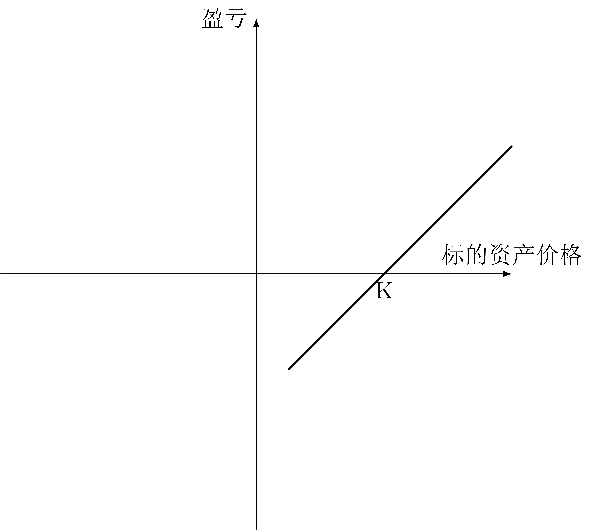
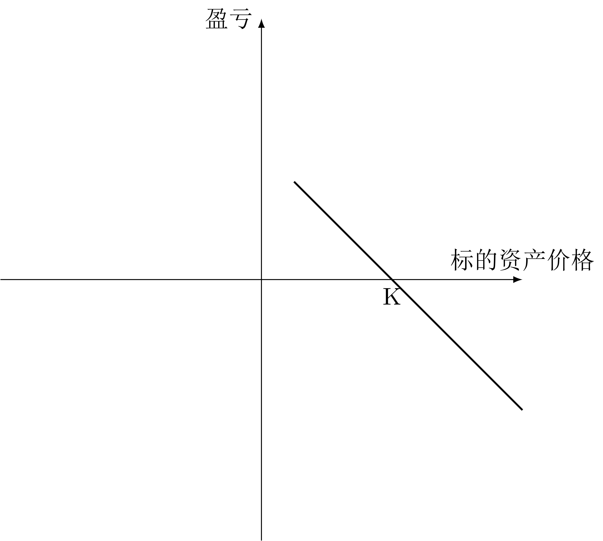

# 前言

本文是武汉大学经济与管理学院王正文副教授 2023 年秋《金融工程》课程同步笔记。

本课程偏向于保险、精算方向，其金融工程的内容是服务于风险管理的。

# 课程前言

## 课程意义

保险学研究的是纯粹风险，这种风险发生时，没有人能够获利。一部分纯粹风险开发为可保风险，设计各种保险产品。

但是风险还包括其他形式，因为有些风险是不确定性，也有获利的可能。风险管理是一个比保险、保险学更大的范畴。

中国的保险市场规模是 20 万亿，但中国的资本市场规模是 80 万亿。当保险发展到一定程度之后，用资本市场实现风险的分散，协助保险业开展业务是必不可少的。

使用金融工程的思维和手段，实现各种资产组合来对冲风险。

## 课程考核

* 签到（3次迟到或旷课直接挂科）
* 课后习题
* 期末考试

每周日的晚上之前要将当周作业截图发给老师。

期末考试不会难，但课程内容比较难。

# 第一章 概述

## 概论

金融工程用金融学的手段将现有的金融资产组合成新的金融资产，使得其各方面特性更加符合投资人的需要。

说白了，金融工程可以被视为一种服务，这种服务为投资者提供多种创造性解决方案，满足市场多样性的金融需求。

* 产品设计：对各种证券风险收益特征的匹配和组合，达到某种特定的目标
* 产品定价：一个新的金融产品需要合理定价

风险管理是金融工程的核心。

* 金融工程技术有时被直接用于解决风险问题
* 有时风险管理本身就是创新性金融工程方案（产品）设计与定价的一部分

## 金融工具和投资者

金融工程运用到工具主要可分为两大类。

* 基础型证券
  * 股票
  * 债券
* 金融衍生品
  * 远期 -> 期货
  * 互换
  * 期权

根据参与目的的不同，市场参与者分为

* 套利者
* 套期保值者
* 投机者

## 金融资产定价原理

### 绝对定价法和相对定价法

* 绝对定价法：根据证券未来的现金流特征，运用恰当的贴现率将这些现金流贴现并加总为现值，该现值就是此证券的合理价格。其实就是“我的价格由未来的我决定”。
* 相对定价法：利用标的资产的价格愚衍生证券价格之间存在的内在关系，直接根据标的资产价格求出衍生证券价格。其实就是“我的价格由现在的别人决定”。

### 无套利定价原理

套利是指利用一个或多个市场存在的价格差异，在没有任何风险且无须自有资金的情况下获取利润的行为。

套利的三个特征

* 无风险
* 无成本
* 有收益

严格的无套利机制必须具有三个特征：

* 无风险：套利活动在无风险的状态下进行
* 可复制：无套利的关键技术是所谓的“复制技术”，即用一组证券复制另一组证券
* 能卖空：金融市场可以**无限**卖空是无风险套利的前提

### 风险中性定价原理

假设：所有投资者对于标的资产所蕴含的价格风险的态度都是中性的，既不偏好也不厌恶。

在此条件下，所有与标的资产风险相同的证券的预期收益率都等于无风险利率，因为风险中性的投资者并不需要额外的收益来吸引他们承担风险。

结论：所有与标的资产风险相同的现金流都应该**使用无风险利率来贴现**求得现值。

### 状态定价法

状态价格：在特定状态发生时回报为 1 ，否则回报为 0 的资产在当前的价格。

这种资产被称为“基本证券”。

特定状态可能有 n 个。

状态定价法语无套利定价原理、风险中性定价原理具有内在一致性。

### 积木分析法

也叫模块分析法，是一种将各种金融工具进行分解和组合的分析方法。

最重要的工具是产品回报图（Payoff）和损益图（Gain or Loss）。

### 衍生证券定价的基本假设

1. 市场不存在摩擦
2. 市场参与者不承担对手风险
3. 市场是完全竞争的
4. 市场参与者厌恶风险，希望财富越多越好
5. 市场不存在无风险套利机会

如果忽视这些假设，那么定价也可以进行，但是会更加复杂，其定价是一个价格区间而不是一个唯一的值。

# 第二章 远期与期货概述

## 第一节 远期与远期市场

### 定义

金融远期合约（Financial Forward Contracts）是指双方约定在未来的某一确定时间，按确定的价格买卖一定数量的某种金融资产的合约。

未来买入标的物的一方称为多方（Long Position），卖出标的物的一方称为空方（Short Position）。确定的价格叫做交割价格。

远期合约并不能保证投资者未来一定获利，但是可以将未来的买卖价格确定下来，从而消除了价格风险。

远期合约不创造任何价值，一方的获利等于另一方的亏损。反映在损益图上，多空双方的损益关于 $x$ 轴对称。

|                                  多头损益图                                   |                                  空头损益图                                   |
| :---------------------------------------------------------------------------: | :---------------------------------------------------------------------------: |
|  |  |

### 分类

1. 远期利率协议（Forward Rate Agreements, FRA）
   
    定义：买卖双方同意从未来某一商定的时刻开始，在某一特定时期内按协议利率借贷一笔数额确定、以特定货币表示的名义本金的协议。
   
    其中，协议利率称为远期利率。第 $n\times m$ 远期利率代表第 $m$ 个月开始，持续 $m-n$ 期的远期利率。如 $1\times4$ 远期利率，即表示 1 个月后开始的期限 3 个月的远期利率。

    所谓名义本金，其实就是一个不需要真实存在的观念上的本金。交割的时候并不需要真的交割这个数额的本金现金，而只需要支付相应的差值即可，从而大大提高资金利用率。

2. 远期外汇协议
   
    定义：买卖双方约定在将来某一时间按约定的汇率买卖一定金额的某种外汇的合约。

    本金可以直接交割，也可以不交割而只交割差额，但具体情况还要分类：

    * 本金不可交割远期（Non-Deliverable Forwards, NDF）：常用于外汇管制的国家
    * 本金可交割但不交割远期（Non-Delivery Forwards）：双方自愿选择不交割本金。
   
3. 远期股票合约（Equity Forwards）

    定义：指在将来某一特定日期按特定价格交付一定数量单只股票或一揽子股票的协议。

    分类：

    * 单只股票远期
    * 指数远期

### 交易机制

远期合约是适应规避现货交易风险的需要而产生的。

远期合约交易机制两大特征：

* 分散的场外交易
* 非标准化合约

远期合约不在交易所交易，而是金融机构与客户私下谈判后签署的，基本不受监管当局监管。

这种场外交易灵活性很强，可以就交割的地点、价格、闺蜜们、品质等进行谈判，满足个性化的需要。但是场外交易市场效率低、流动性差、违约风险相对较高。

## 期货与期货市场

### 定义

金融期货合约（Financial Futures Contracts）是指在交易所交易的、协议双方约定在将来某个日期按事先确定的条件（包括交割价格、交割地点和交割方式等）买入或卖出一定标准数量的特定金融工具的标准化协议。

本质上说，期货与远期是完全相同的，期货是标准化了的远期。

期货解决了远期的市场效率低、流动性差的问题，还设立了其他的措施来减小对手违约风险。

分类：

* 股票指数期货
* 外汇期货
* 利率期货

### 交易机制

**标准化**和**集中交易**是期货交易的基本特征。

除此之外，清算机构还有其他的制度来规避违约风险。

1. 标准化交易
2. 每日盯市结算制度（Market to Market and Daily Settlement）
3. 保证金（Margin）
4. 会员对会员间的无限连带清偿责任

向下熔断的可能性高于向上熔断的可能性，体现了微笑曲线。行为金融学角度解释，就是禀赋效应。

# 第三章 远期和期货定价

## 第一节 远期价格和期货价格

### 远期价值、远期价格与期货价格

远期价值是指远期合约本身的价值。

* 在签订远期合约的时候，如果信息是对称的，而且合约双方对未来的预期相同，对于一份公平的合约，多空双方所选择的交割价格应使**远期价值在签署合约时等于零**。（所谓“零”，其实就是一张纸的价格。也就是说，签订合约这一个行为在当时并不会立刻给双方带来任何盈利或损失，签订合约本身花费的成本也近似为零。）
* 在远期合约签订以后，由于交割价格不再变化，多空双方的远期价值将随着标的资产价格的变化而变化。

远期价格是指使远期合约签订时价值为零的交割价格。远期价格是理论上的交割价格。

* 一份公平的远期合约在签订当天应使得交割价格等于远期价格（也就是，让实际契合理论）。如果不相等，那就存在套利空间。
* 在远期合约签订以后，交割价格已经确定，远期合约的价值不一定为零，远期价格也就不一定等于交割价格。

类似地，期货价格是指是的期货合约价值为零的理论交割价格。

### 远期价格与期货价格的关系

* 当无风险利率恒定且所有到期日都相同时，交割日相同的远期价格和期货价格应该相等。
* 当标的资产价格与利率呈正相关时，期货价格高于远期价格。
  * 标的资产价格上升时，期货价格也会随之升高，期货多头因每日结算而立刻获利，并以高于平均利率的利率将所获利润再投资。
  * 标的资产价格下降时，期货价格降低，期货多头立刻产生亏损，但是可以按低于平均利率的利率从市场上融资来补充保证金。
* 当标的资产价格与利率呈负相关时，远期价格高于期货价格。

### 基本假设与符号

假设：

1. 没有交易费用和税收
2. 市场参与者能以相同的无风险利率借入和贷出资金
3. 远期没有违约风险
4. 允许现货卖空
5. 无套利
6. 期货合约的保证金账户支付同样的无风险利率

符号：

*  $T$ ：合约到期时间，单位为年
*  $t$ ：当前时刻，单位为年， $T-t$ 代表距离到期的剩余时间
*  $S$ ：标的资产在 $t$ 时刻的价格
*  $S_T$ ：标的资产在 $T$ 时刻的价格（在 $t$ 时刻这个值是未知量）
*  $K$ ：远期合约中的交割价格
*  $f$ ：远期合约多头在 $t$ 时刻的价值，即 $t$ 时刻的远期价值
*  $F$ ： $t$ 时刻理论价格，简称为远期价格和期货价格
*  $r$ ： $T$ 时刻到期的以连续复利计算的 $t$ 时刻的无风险利率

## 无红利资产远期合约的定价

### 无红利资产的远期价值

多头定价：

* 资产 A ：一份远期多头 + 现金 $K$ 
* 资产 B ：一份标的资产

以上两个资产在 $T$ 时刻可以真实成交。

 $T$ 时刻的现金 $K$ 贴现到现在就是 $K \mathrm{e}^{-r(T-t)}$ 。

$$
f + K \mathrm{e}^{-r(T-t)} = S
$$

空头定价：

* 资产 A ：一份远期空头 + 一份标的资产
* 资产 B ：现金 $K$ 

以上两个资产在 $T$ 时刻可以真实成交。

$$
-f + S = K \mathrm{e}^{-r(T-t)}
$$

由上面两个式子都可以得出远期价值

$$
f = S - K \mathrm{e}^{-r(T-t)}
$$

理想状态下，远期合约是一张一文不值的废纸，即 $f=0$ ，这种状态下的交割价格 $K$ 就等于远期价格 $F$ ，于是有

$$
F = S \mathrm{e}^{r(T-t)}
$$

这就是无红利资产的现货-远期平价定理。它表明，对于无红利资产，远期价格等于标的资产现货价格以无风险利率计算的终值。也就是说，买期货，和买现货并把现货存在无风险银行里吃利息，是完全一样的。

### 远期价格的期限结构

在 $T$ 时刻和 $T^*$ 时刻，有

$$
F = S \mathrm{e}^{r(T-t)}
$$

$$
F^* = S \mathrm{e}^{r^*(T^*-t)}
$$

相除可以得到

$$
F^*=F \mathrm{e} ^ {r^*(T^*-t) - r(T-t)}
$$

这个式子的作用是，假如已知 3 个月远期的远期价格，给定 3 个月利率和 6 个月利率，就可以求出 6 个月远期的价格。其实也可以从 3 个月远期解出现货价格 $S$ ，再由现货价格算出 6 个月远期价格，但是这样很麻烦，使用远期价格的期限结构可以直接计算。

## 支付已知红利资产远期合约的定价

多头定价：

$T$ 时刻：

* 资产 A ：一份多头合约 + 现金 $K$ 
* 资产 B ：一份资产

贴现后：

* 资产 A ：一份多头合约 + 现金 $K \mathrm{e}^{-r(T-t)}$ 
* 资产 B ：一份资产 - 红利  $I$ 

$$
f + K \mathrm{e}^{-r(T-t)} = S - I
$$

空头定价：

$T$ 时刻：

* 资产 A ：一份空头合约 + 一份资产
* 资产 B ：现金 $K$ 

贴现后

* 资产 A ：一份空头合约 + 一份资产 - 红利 $I$ 
* 资产 B ：现金 $K \mathrm{e}^{-r(T-t)}$ 

$$
-f + S - I = K \mathrm{e}^{-r(T-t)}
$$

以上两种方式均可得到远期价值

$$
f = S - I - K \mathrm{e}^{-r(T-t)}
$$

也就是说，对于确定分红的证券，只需要用 $S-I$ 代替 $S$ 去进行计算即可。

理想状态下，远期合约是一张一文不值的废纸，令 $f=0$ 并将 $K$ 代换为 $F$ ，可得远期价格（交割价格）

$$
F = (S-I)\mathrm{e}^{r(T-t)}
$$

这表明支付已知红利的远期价格等于标的资产现货价格与已知红利**现值**差额的**无风险终值**。

## 支付已知红利率资产远期合约的定价

多头定价：

$T$ 时刻：

* 资产 A ：一份多头合约 + 现金 $K$ 
* 资产 B ：1 份资产

贴现后：

* 资产 A ：一份多头合约 + 现金 $K \mathrm{e}^{-r(T-t)}$ 
* 资产 B ： $\mathrm{e}^{-q(T-t)}$ 份资产

$$
f + K \mathrm{e}^{-r(T-t)} = S\mathrm{e}^{-q(T-t)}
$$

空头定价：

$T$ 时刻：

* 资产 A ：一份空头合约 + 1 份资产
* 资产 B ：现金 $K$ 

贴现后：

* 资产 A ：一份空头合约 + $\mathrm{e}^{-q(T-t)}$ 份资产
* 资产 B ：现金 $K \mathrm{e}^{-r(T-t)}$

$$
-f + S\mathrm{e}^{-q(T-t)} = K \mathrm{e}^{-r(T-t)}
$$

以上两种方法均可得到远期价值

$$
f = K \mathrm{e}^{-r(T-t)} - S\mathrm{e}^{-q(T-t)}
$$

理想状态下，远期合约是一张一文不值的废纸，令 $f=0$ 并将 $K$ 代换为 $F$ ，可得远期价格（交割价格）

$$
F = S \mathrm{e}^{(r-q)(T-t)}
$$

## 远期与期货价格的一般结论

### 完美市场下的持有成本模型

$$
\left\{
\begin{aligned}
        & F = S \mathrm{e}^{r(T-t)} \\
        & F = (S-I)\mathrm{e}^{r(T-t)} \\
        & F = S \mathrm{e}^{(r-q)(T-t)} \\
\end{aligned}
\right.
$$

归纳可知，将标的资产中远期多头到期时无法获得的确定性收益剔除，对标的资产价格的剩余部分以无风险利率计算终值，就得出了理论的远期价格（交割价格）。

直观理解，持有资产（黄金、原油）等成本是需要成本的，持有资金也是有货币的时间价值作为成本的，这些加总起来就统称持有成本。

$$
\text{持有成本} = \text{存储成本} + \text{无风险利息成本} - \text{标的资产在合约期限内提供的收益}
$$

### 非完美市场条件下的远期定价

之前的市场下，多头与空头得到的定价结果完全一致。如果市场并不完美，两者就不一致。两者中间的区间都是无套利价格。

如果每一笔交易费率为 $Y$ ，借入利率与借出利率分别为 $r_b,r_l(r_l<r_b)$ ，保证金率为 $X$ ，那么无套利价格区间为

$$
[(1-X)S(1-Y)\mathrm{e}^{r_1(T-t)}, S(1+Y)\mathrm{e}^{r_b(T-t)}]
$$

### 消费性资产的远期定价

诸如航空公司的航空燃油、农民收获的粮食等资产，不是纯粹的投资性资产，而具有消费的属性。其现货具有即期消费的属性，但远期没有。因此远期价格低于理论上的交割价格，即

$$
F\le S\mathrm{e}^{c(T-t)}
$$

$$
\text{持有成本} = \text{存储成本} + \text{无风险利息成本} - \text{标的资产在合约期限内提供的收益} - \text{便利收益}
$$

## 远期价格与现货价格的关系

### 同一时刻下二者的关系

1. 现货价格与远期价格孰高孰低取决于持有成本。
2. 现货价格制约着远期价格。如果现货市场规模较小，存在恶性炒作，那么远期市场就会因恶性炒作而出问题。
3. 期货价格对现货具有“价格发现”（Price Discorvery）功能。投资者越来越多地现在远期市场上操作，使得信息现在远期市场上得到反映，然后再传导到现货市场。

### 远期价格和未来现货预期价格的关系

$$
E(S_T) = S \mathrm{e}^{y(T-t)}
$$

其中 $E(S_T)$ 是 $T$ 时刻现货价格的期望值， $y$ 为该资产的连续复利预期收益率（ $y$ 取决于标的资产的系统性风险）。

大多数情况下资产的系统性风险都大于零，则 $y>r$ ，因此大多数情况下 $f<E(S_T)$ 。

# 第四章 期货和远期的应用

## 套期保值

分类：

* 多头套期保值：进入多头市场，对现货市场进行套期保值，消费者采取的套期策略、。
* 空头套期保值：生产者采取的套期策略。