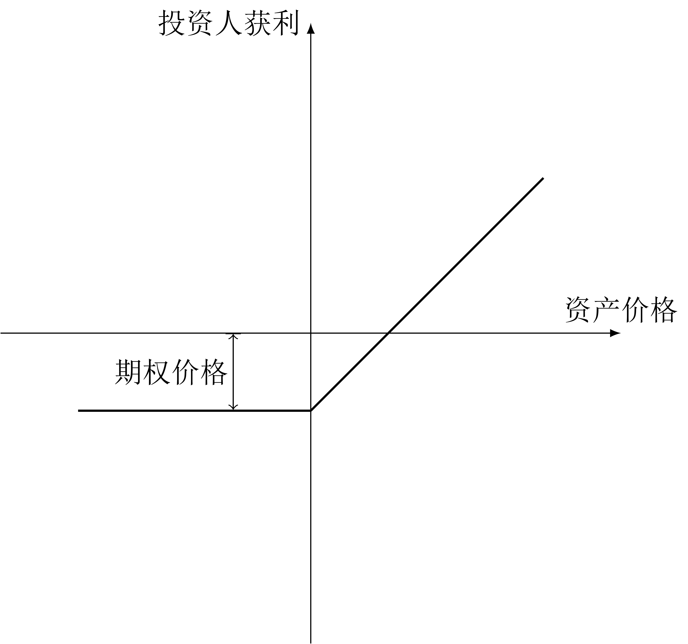

# 前言

感谢 B 站 UP 主[经管老邢](https://space.bilibili.com/584599085)，他轻松诙谐的视频讲解极大地帮助我推进了这门课程。很喜欢他的东北味普通话。

# 第零章 零碎的基础知识

# 第一章 导论

略

# 第二章 金融工程基本理论与分析方法

## 第一节 无套利均衡定价理论（Non-Arbitrige Pricing Principle）

### 地位与定义

无套利均衡定价理论是金融学各种初级定价方法的理论根基。

> 伯恩斯坦：“无套利均衡指的是不存在一种零成本赚取无风险利润的投资方式。”

### 假设条件

1. 资产在市场交易；
2. 投资者**自由进入**市场；
3. 任何交易者都可**无限制**取得市场上资产的任意多头和空头，也可以无限制取得合成资产的多头和空头；
4. 投资者可按无风险利率进行**无限制的现金借贷**；
5. **无交易费用**，含经纪人佣金、税、保证金、**融券成本**。往后只考虑融资成本，忽略融券成本。
6. **无违约风险**。

总结：有的是人，有的是钱，效率极高，人人遵纪守法的理想市场。

### 套利与无套利原理

定义： 利用一个或多个市场存在的价格差异，在不承担任何风险且无需自有资金的情况下获取利润的行为。

学术套利的三大特征

* 无风险：保证能获得正收益；
* 零投资：存在自融资策略，随意零成本贷款；
* 获得利润：获得高于国债收益的无风险收益。

想套利先借钱，不能用自己的钱，否则不叫套利。

无套利原理：在有效市场中，套利机会一旦存在，就会被无数投资者利用，投资者的行动会使得原有形成套利机会的供求格局发生改变，导致套利空间逐渐消失

**理论**上说，当金融市场出现无风险套利机会时，每一个交易者都可以构筑出**无穷大的套利组合**来赚取无穷大的利润。这种巨大的套利头寸成为推动市场价格变化的力量，迅速消除套利机会。

**无套利状态才是市场均衡状态**。套利机会的出现是市场供求格局发生变化导致的短期漏洞。市场效率越高，套利机会消失地越快，重建均衡的速度越快。

PS：无套利原理不代表市场永远处于均衡状态。正如经济学中的均衡一样，虽然金融市场的均衡确实存在，虽然市场有着向均衡状态变化的趋势，但事实上大多数时候市场都不处于均衡状态，存在套利的机会。

### 无套利定价

#### 一价定律

> 在无套利均衡的情况下，如果**两个资产是等值**的，那么他们的市场价格必须一样，否则就会产生套利。

资产等值：现金流特征完全相同。

现金流特征：现值、终值、贴现率。

做题应用方法：同一笔资金 $F$ ，必须根据题意构造出两种投资组合，然后再使得这两种资产的现金流特征相同。

推论：

* 如果两种资产现金流相同，那么他们完全可以互相替代。
* 在无套利市场上，投资任何资产的收益都是相同的。

用途

* 让金融活动成为可计算的资产（价值投资）：根据目前的资产价格与价值，做出做多或做空的决策，实现盈利。
* 复制资产以实现风险对冲/分散：用其他形式资产代替等值资产。
* 合成新资产：构建一个金融工具组合使之与被模仿的金融工具具有相同价值。

## 第二节 风险中性定价理论（Risk Neutral Pricing Theory）

### 风险中性假设

> 假定所有投资者都是风险中性的，既不偏好也不厌恶，不在乎得失，不在乎风险。

这与无套利定价理论本质上是一样的，都是对金融的理想化，只不过一个假设的是完美的市场，另一个假设的是完美的投资者。

二者一脉相承，所得结果具有一致性。

### 风险中性原理

在风险中性假设下，投资者不需要额外的收益来吸引他们承担更高的风险。

因此所有证券的**预期收益率都等于无风险利率**，所有现金流都应该**使用无风险利率进行贴现**得到现值。

风险中性定价不仅仅适用于对风险麻木的投资者，也适用于厌恶风险的投资者，具有普适性。

### 总结

1. 收益率 = 无风险利率
2. 贴现率 = 无风险利率
3. 投资的风险溢价等于0

PS： 风险溢价 = 风险投资收益率 - 无风险利率

## 第三节 积木分析法（头寸叠加法）

### 介绍

定义：将各种金融工具的**头寸图形**叠加起来分析资产组合，类似于堆积木，称为积木分析法。

两项核心技术：

* 无套利均衡定价技术
* 复制与分解技术

### 头寸（Position）

#### 定义

* 银行领域头寸：指可支配资金。
* 金融工具头寸：投资人根据自己对某一项资产未来价值走势的判断，而持有的买入或卖出该资产的立场。

#### 分类

* 多头（Long Position）：投资人看多某资产并买入资产，希望资产未来涨价以获利时，持有的头寸叫多头。
* 空头（Short Position）：投资人看空某资产并卖出资产，希望资产未来价格下跌后再买回来以获利时，持有的头寸叫空头。

### 头寸图形

常见的有两种：损益图和回报图。

|  |  |
| :---------------------------------------------------------: | :---------------------------------------------------------: |
|                           损益图                            |                           回报图                            |

### 六种基本积木模块

|  |  |  |
| :---------------------------------------------------------: | :---------------------------------------------: | :---------------------------------------------: |
|                        标的资产多头                         |             多头买权 / 看涨期权多头             |             空头卖权 / 看跌期权空头             |

|  |  |  |
| :---------------------------------------------------------: | :---------------------------------------------: | :---------------------------------------------: |
|                        标的资产空头                         |             空头买权 / 看涨期权空头             |             多头卖权 / 看跌期权多头             |

规律：

* 凡是做空期权的，无论做空的是看涨期权还是看跌期权，收益都有上限，亏损都可以达到无穷大；
* 凡是做多期权的，无论做多的是看涨期权还是看跌期权，亏损都有上限，收益都可以达到无穷大；
* 资产叠加时，按照正常的函数简单相加的规律即可。

## 第四节 利息的计算方法

### 利率和利息

利率：一定时间内，利率和本金的比率。

利息：让渡本金使用权所需要得到的补偿。

利率和利息都可以看做是钱的价格。

如果没有特殊强调，默认利率指的都是年利率。

### 单利和复利

单利：利息不计入下一周期的本金中。

$$
I=Art
$$

其中

*  $I$ ：利息
*  $A$ ：本金
*  $r$ ：利率
*  $t$ ：计息期数

简单复利：利息加入本金中，共同计算下一周期的利息。

$$
F=A(1+r)^t
$$

其中

*  $F$ ：本息和
*  $A$ ：本金
*  $r$ ：利率
*  $t$ ：计息期数

连续复利：计息期数无限大、计息期数无穷短的复利

$$
F=A \mathrm{e}^{rt}
$$

其中

*  $F$ ：本息和
*  $A$ ：本金
*  $r$ ：利率
*  $t$ ：计息期数

注意合法的连续复利的单次利率是逐渐降低的，这样才能保证有极限。如果不满足这个条件，那就是无穷高利贷。

## 第五节 现金流和货币的时间价值

### 定义

现金流：一定时间内，现金或现金等价物流入或流出的数量。

货币的时间价值：货币的价值随着时间的变化而变化。如果一笔钱存放起来什么也不做，其实际购买力往往会下降，造成贬值。

原因：

* 经济学角度：通货膨胀。
* 金融学角度：钱能生钱，投资的机会成本。按照风险中性假说，货币的时间价值最慢也至少按照国债收益率的标准在让货币贬值。
* 行为金融学角度：人们有把付出成本这件事向后推延的倾向，对于消费者来说现在的货币比未来的货币更有价值。

所以，如果想要准确比较不同时间点上的货币的价值，就必须把他们换算成同一个时间点上的价值。

### 贴现与贴现公式

现值：未来一笔钱在现在的价值。

终值：现在一笔钱在未来的价值。

把终值换算成现值的过程就叫贴现。

单利贴现：略

复利贴现：

$$
A=\frac{F}{(1+r)^t}
$$

连续复利贴现

$$
A=F \mathrm{e}^{-rt}
$$

# 第三章 风险与风险管理理论

## 第一节 风险的定义和特征

风险：可能发生损失的不确定性状态

特征：

* 客观性
* 损失性：不一定实打实产生了损失才算风险，即使是赚钱了也是风险
* 不确定性
* 可测性
* 变异性

金融学只研究无法避免且不可预测的风险。

## 第二节 风险的识别

全是纸上谈兵，略。

## 第三节 风险的衡量

基本工具：

* 概率和概率密度
* 期望值 $E(X)=\sum_{k=1}^n x_kp_k$ 
* 方差和标准差
    
    通常使用投资预期**收益率**的方差或标准差来反映风险。

    局限性：只有在期望**收益**相同的时候才能用方差和标准差比较不同投资项目的风险。
$$
D(x)=
\begin{cases}
    \displaystyle \sum_{k=1}^n [x_k-E(X)]^2P_k, & \text{离散型} \\
    \displaystyle \int_{-\infty}^{\infty}{[x-E(X)]^2f(x)} \mathrm{d} {x}, & \text{连续型}
\end{cases}
$$

$$
\sigma_X=\sqrt{D(x)}
$$

* 标准离差率

$$
\gamma=\frac{\sigma}{E(X)}
$$

* 在险价值（VaR）

    用一个可能损失的最大金钱数来衡量风险的简单粗暴的指标

### 在险价值

#### 第一章定义

$$
P(\Delta V\Delta t\le VaR)=\alpha
$$

其中

-  $VaR$ ：在险价值，可能的最大损失
-  $\Delta V$ ：资产或资产组合在一定时间内的价值损失
-  $\Delta t$ ：一定时间
-  $\alpha$ ：某一给定的置信水平

#### 第二种定义

$$
VaR=E(S)-S^*
$$

其中

-  $VaR$ ：在险价值，可能的最大损失
-  $S$ ：资产或资产组合的期末价值
-  $E(S)$ ：期末预期价值
-  $S^*$ ：某一给定的置信水平下的期末最低价值

#### 计算方法

在正态分布情况下：

$$
VaR=-S_0\Phi^{-1}(\alpha)\sigma T^\frac{1}{2}
$$

其中

*  $S_0$ ：起初投资额。
*  $\Phi^{-1}()$ ：标准正态分布累计逆函数。
*  $\alpha$ ：显著性水平。 $(1-\alpha)$ 是置信水平。
*  $\sigma$ ：投资收益率的标准差，或波动率。
*  $T$ ：投资持续时间。

置信水平可以人为改变，但是一般情况下遵循国际标准。巴塞尔协议规定为 $99%$ ，内部资产是 $99.96%$ 。

#### 局限性

1. 只能衡量常规风险，对黑天鹅无力；
2. 根据历史经验推导未来；
3. 假设收益服从正态分布，对于非对称分布无法刻画；
4. 属于处在淘汰边缘的方法；
5. 置信区间无法确定。

## 第四节 风险管理

略

# 第四章 市场与资产组合理论

## 第一节 有效市场假说（Efficient Market Hypothesis）

### 定义

> 尤金·法玛：“如果有用的信息能够立即地、无偏见地在证券价格中得到反映，那么市场被认为是有效的。”

> 简森：“如果根据一组信息进行交易，而无法赚得超额回报，那么资本市场就是有效的。”

### 前提：理性预期理论

人们对市场的预期，是基于当前所有信息以及对历史规律的最优认识，在此基础上对未来做出预期。

但是现实中，并不是所有人都是理性的。

假设条件：

1. 市场参与者理性；
2. 市场只有无套利均衡；
3. 可用于预测股票表现的信息原点已经在股价中反映出来；
4. 信息公开且有效，即价格已经有效地反映了所有可能得到的信息；
5. 市场无摩擦。

### 为何价格是随机的

1. 新信息总是随机的，无法预测的；
2. 随机到来的新信息一定导致随机的价格变化；
3. 资产价格的随机变化的本质的信息的多元化和随机化。

### 小结

证券价格的变化的随机性是金融市场理性的产物。

市场的有效性受信息的影响。信息越透明、流动越快、越真实，人们获取和理解信息的能力越强，市场就越有效。

现实中的市场并不是完全有效的，或者说只是在某种程度上接近有效市场。

### 有效市场的分类

* 弱有效市场：资产价格已经全部反映了全部能从市场交易数据得到的信息。此时技术分析手段在理论上会失效。
* 半强有效市场：资产价格反映了所有公开可得信息。此时技术分析和基本面分析在理论上都会失效。
* 强有效市场：资产价格反映了全部信息，包括公开的、私有的、公共的、内幕的、心里想的。此时任何交易手段都失效。

### 如果市场是有效的，我们为什么还要学习金融

有效的市场使得套利的机会不存在，但是有效市场的产生本就是套利的结果。

所以说，如果市场保持有效状态，套利过程其实没有终止，而是一直在进行。简而言之，市场上可以套到利。

不是所有投资人都是理性的。行为金融学认为，市场上的资产价格是由少数**边际投资者**的行动确定的，其他的投资者只是跟随这些边际投资者的行动而行动。非理性的行为往往更好预测，因此，理性的投资者可以根据非理性的投资者可能采取的行为来进行套利。

学习金融学可以使得我们更加理性，我们收集信息和理解信息的能力更强，我们就更有可能套到利，成为边际投资者。

斯蒂格利茨悖论：在完全竞争的市场中，如果不确定性仅仅来源于未来收益的随机性，则完全揭示的竞争性，理性预期均衡不具有稳定性，甚至不存在。

市场不可能是完全有效的，否则就会触发斯蒂格利茨悖论。

## 第二节 MM定理

### 定义

> 在不考虑公司所得税，且企业经营风险相同而只有资本结构不同时，公司的市场价值与公司的资本结构无关。

理解：一个投资项目值多少钱，只取决于项目本身的盈利能力，与做项目的钱是怎么来的无关。简单来说，就是收益与成本无关。

米勒的比喻：“无论你把一块披萨饼分成4份还是6份，那仍然只是一块披萨饼，不会变大或者变小。”

公司的钱怎么来的不重要，无论完全是借来的贷款，还是马路上捡来的纯资产，都不重要。即使公司的负债率非常高，这也不会影响公司的盈利的盈利能力。公司的盈利能力只和公司的业务有关。

### 假设

1. 市场是有效的；
2. 信息充分，不存在交易成本；
3. 证券无限可分，投资者是理性经济人；
4. 投资者具有预期一致性；
5. 自由借贷，无违约风险。

### 推论

1. 有效金融市场上，一个公司的价值是由其资产的增值能力决定的，而与该公司的融资方式以及资本结构无关；
2. 资金成本取决于资金的运用，而不是取决于资金的来源；
3. 企业的价值与其资本结构没有关系；
4. 融资活动本身不创造任何价值；
5. 公司股票的价格应该是由企业创造价值的能力所决定的，而企业的融资活动不应该对股票的价格产生任何影响；

### MM定理的修正

如果考虑到所得税，而且公司先还债再缴税，那么如果公司的负债率很高，要交的税就会变少。如果公司的负债率是100%，那么赚的钱都拿去还债了，就不用缴税了，单着也意味着公司没法保留利润。

这说明，考虑税收的情况下，公司的价值就和融资活动有关的。

这个其实没什么用，因为没有公司会仅仅为了少缴税而多借贷。

## 第三节 投资组合理论

### 马科维茨的投资组合理论

#### 理论假设

1. 投资者都是风险规避的，要求获得与所承担风险匹配的收益；
2. 投资者只进行单期投资，所有投资组合理论本质上是静态投资决策理论；
3. 不考虑税收；
4. 投资者理性，这就是说，在期望收益率相同的情况下选择风险最小的组合，在风险相同的情况下选择期望收益率最大的组合；
5. 投资者只根据两个指标来决定有价证券的价值，分别是：预期收益和风险。具体地，
   1. 预期收益用预期收益的期望值表示；
   2. 风险用预期收益率的方差（标准差）来表示。

### 有效组合边界

### 资本市场线

### 夏普比率

### 分离定理