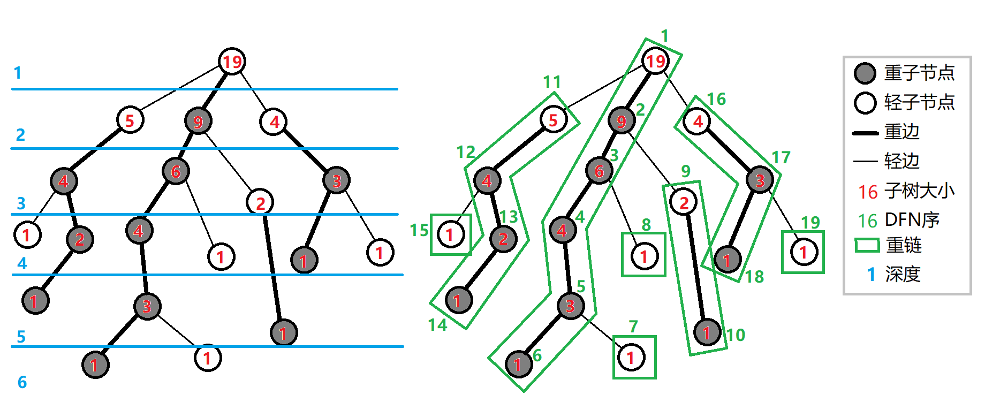

# 前言

本文主要根据 OIwiki 的数据结构部分展开，也按照常见的考点加入了一些图论、字符串领域的数据结构。本文只包含最基本的理论介绍，相关的实现方式、具体的解题思路和代码都放在站内其他文章中。

后续做到比较好的数据结构题也会添加进这篇文章中来。

# 块状数据结构

## 分块初步

经典例题1：参见站内文章 

总体思路：寻找一种合理的分块方式，操作区间中不是整块的部分暴力求解，是整块的部分打标记。

寻找最优分块方式，通常是对最坏时间复杂度求最小值，取得最小值时的约束条件可以得到最优块长。

在分块的基础上，依然可以使用差分、前缀和等方式来优化算法。差分、前缀和不仅可以对原序列使用，也可以对块序列使用。

相关注意事项：

* 块长不一定等于块数。
* 区间两端点在同一个块中，必须特判后直接 `return` ，否则让程序自然执行可能会把区间外面的部分也算到。

练习题：

*  : 分块 + 排序
*  ：分块 + 排序 + 树状数组

## 莫队算法初步

莫队是一种优雅的暴力。

### 使用条件

对于序列上的区间询问问题，如果从 $[l,r]$ 的答案能够 $O(1)$ 扩展到与其相邻的区间的答案，那么可以在 $O(n\sqrt{n})$ 的复杂度内求出所有询问的答案。

### 使用方法

1. 对所有询问离线；
2. 将序列进行根号分块；
3. 将所有询问排序，排序规则为：以 $l$ **所在的块的编号**为第一关键字，以 $r$ 的大小为第二关键字，生序排序；
4. 将排序好的询问遍历，每次迭代暴力移动指针更新答案。

### 复杂度计算

OIwiki上面说的太复杂的，我用自己的方法证明一下。

先考虑左端点。

考虑最坏情况，如果每相邻的两次询问，左端点之间的距离都非常远，那最多也只不过是 $O(\sqrt n)$ 级别的距离，因为新旧两个左端点毕竟都在同一个块内。

当迭代进入一个新的块时，左端点也移动的距离最坏也只是 $O(2\sqrt n)$ ，依然没有改变复杂度。

又由于每移动一格更新答案只需要花费 $O(1)$ 的时间，所以对于总共 $n$ 次询问，更新答案的次数只是 $O(n\sqrt n)$ 级别。

再考虑右端点。

因为询问排序时所参考的第二关键字是 $r$ 的大小，所以在同一个块内，所有询问的 $r$ 保持单调不减，右端点一直在向右移动，因此右端点移动的次数最坏为 $O(n)$ 。又由于有 $O(\sqrt n)$ 个块，因此总的复杂度是 $O(n\sqrt n)$ 。

当迭代进入一个新的块时，最坏情况下右端点需要从序列的最右端移回到左端，复杂度依然是 $O(n)$ 。这样的远距离移动最多只需要做 $O(\sqrt n)$ 次，也就是块数次。总的复杂度依然是 $O(n\sqrt n)$ 。

在这个算法中，左右端点的运动相对独立，一个端点的移动不会影响另一个端点的移动次数，两者的复杂度是线性加和而不是相乘，因此总的复杂度为 $O(n\sqrt n)$ 。

### 优化：奇偶化排序

对于奇数块，按 $r$ 升序排序；对于偶数块，按 $r$ 降序排序。

这样的话，左端点进入新块后，右端点可以在回来的路上就把这个块的答案更新好，不用多跑一趟。

这个操作可以实现常数级别的优化。

### 练习题

*  ：莫队 + gcd

## 块状数组

### 本质

所谓块状数组，就是分块版本的线段树。借用线段树中打标记的思想，优先对整块打标记。如果涉及非整块的零碎操作，就把标记暴力下传后暴力修改。

### 应用场景

遇到**树形数据结构难以维护**的区间操作时，应当考虑块状数组。

## 块状链表

### 本质

所谓块状链表，其实就是利用链表将原序列分块后以块为节点建立链表，每个节点的大小保持在 $O(\sqrt n)$ 。

随着每一块的大小逐渐增大，将其中的某些节点分裂成新的节点，从而保持每一块的大小都在 $\sqrt n$ 级别。每次分裂可以暴力分裂，一次分裂的时间复杂度为 $O(\sqrt n)$ 。

块状链表实际上是对普通链表的均摊。

|          | 插入、删除、修改 | 单点查询、区间查询 |
| :------: | :--------------: | :----------------: |
| 普通链表 |      $O(1)$      |       $O(n)$       |
| 块状链表 |   $O(\sqrt n)$   |    $O(\sqrt n)$    |

### 应用场景

当**涉及大量的插入、删除操作**时，应当考虑块状链表。

### STL `rope`

STL 中的 `rope` 可以实现块状链表的所有基础操作，但实际上它内部是用可持久化平衡树实现的，而不是块状链表，因此复杂度为 $O(\log n)$ 。

使用方法如下：

```cpp
#include <ext/rope>
using namespace __gnu_cxx;
```

|            操作            |                   作用                    |
| :------------------------: | :---------------------------------------: |
|      `rope <int > a`       | 初始化 `rope`（与 `vector` 等容器很相似） |
|      `a.push_back(x)`      |         在 `a` 的末尾添加元素 `x`         |
|     `a.insert(pos, x)`     |    在 `a` 的 `pos` 个位置添加元素 `x`     |
|     `a.erase(pos, x)`      |   在 `a` 的 `pos` 个位置删除 `x` 个元素   |
|    `a.at(x)` 或 `a[x]`     |         访问 `a` 的第 `x` 个元素          |
| `a.length()` 或 `a.size()` |              获取 `a` 的大小              |

### 树上莫队与树分块

括号序上分块。

暂不深入学习，改天再说吧，分块题写麻了都。。。。。

# 树链剖分

## 重链剖分

这一部分 OIwiki 讲的实在是太好了，言简意赅，所以我直接 Copy-Paste 。

### 相关定义

对于一棵树，定义其最大的子树的根为**重子节点**，其他子节点为**轻子节点**。

定义根节点到其重子节点的边为**重边**，到其他子节点的边为**轻边**。

首尾相连的若干条边构成**重链**。落单的节点也当做重链。

于是整棵树就被剖分成若干条重链。



### 性质

**树上每个节点都属于且仅属于一条重链。**

重链开头的结点不一定是重子节点（因为重边是对于每一个结点都有定义的）。

所有的重链将整棵树**完全剖分**。

在剖分时**重边优先遍历**，最后树的 DFS 序上，重链内的 DFS 序是连续的。按 DFN 排序后的序列即为剖分后的链。

一颗子树内的 DFS 序是连续的。

可以发现，当我们向下经过一条**轻边**时，所在子树的大小至少会除以二。

因此，对于树上的任意一条路径，把它拆分成从 LCA 分别向两边往下走，分别最多走 $O(\log n)$ 次，因此，树上的每条路径都可以被拆分成不超过 $O(\log n)$ 条重链。

### 实现

两次 DFS 预处理出所有的信息。

我们先给出一些定义：

* $fa(x)$  表示节点  $x$  在树上的父亲。
* $dep(x)$  表示节点  $x$  在树上的深度。
* $siz(x)$  表示节点  $x$  的子树的节点个数。
* $son(x)$  表示节点  $x$  的 重儿子。
* $top(x)$  表示节点  $x$  所在 重链 的顶部节点（深度最小）。
* $dfn(x)$  表示节点  $x$  的 DFS 序，也是其在线段树中的编号。
* $rnk(x)$  表示 DFS 序所对应的节点编号，有  $rnk(dfn(x))=x$ 。

第一次 DFS 求出  $fa(x),dep(x),siz(x),son(x)$ ，第二次 DFS 求出  $top(x),dfn(x),rnk(x)$ 。

### 应用

#### 求 LCA

不断向上跳重链，当跳到同一条重链上时，深度较小的结点即为 LCA。

向上跳重链时需要先跳所在重链顶端深度较大的那个。

#### 路径上维护

一段重链上的 DFS 序是连续的，可以使用线段树、树状数组维护。

对于询问，不断向上跳重链，边跳边记录答案。当跳到同一条重链上时，深度较小的结点即为 LCA。残余的部分特殊询问即可。

对于修改，同理。有若干次跳跃直接跳到链顶，就对整个链打标记。最后一次跳跃后，两个节点位于同一个重链上，但不一定跳到了链顶，所以只对这一段打标记即可。打标记的具体范围可以由 DFS 序确定。

重点：向上跳重链时需要先跳所在重链顶端**深度较大的那个**。

#### 子树维护

有时会要求，维护子树上的信息，譬如将以 x 为根的子树的所有结点的权值增加 $v$ 。

在 DFS 搜索的时候，子树中的结点的 DFS 序是连续的。

每一个结点记录 `bottom` 表示所在子树连续区间末端的结点。

这样就把子树信息转化为连续的一段区间信息。

## 长链剖分

## 实链剖分

# 二叉搜索树

# 可持久化数据结构

# 树套树

# 动态树

# 图论数据结构

# 字符串数据结构

# 其他高级数据结构
